# TUIX Framework: Advanced Patterns and Internal Architecture

*Ultra Instinct Mode Analysis*

## Executive Summary

This document provides an exhaustive analysis of TUIX's most sophisticated architectural patterns, internal data structures, and advanced usage scenarios. It explores the framework's capability for handling enterprise-scale applications with complex coordination requirements, advanced performance optimization, and intricate plugin ecosystems.

## Advanced Architectural Concepts

### 1. Multi-Dimensional Scope Hierarchies

The TUIX scope system implements a sophisticated multi-dimensional hierarchy that goes beyond simple tree structures:

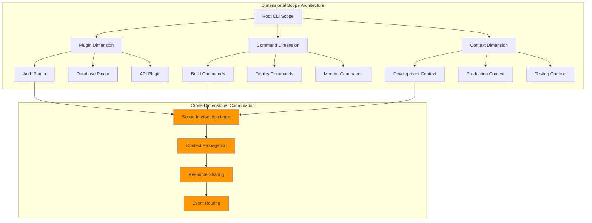

**Key Innovation**: Scopes can exist in multiple dimensions simultaneously, enabling complex plugin interactions with context-aware command execution.

### 2. Advanced Event Choreography Patterns

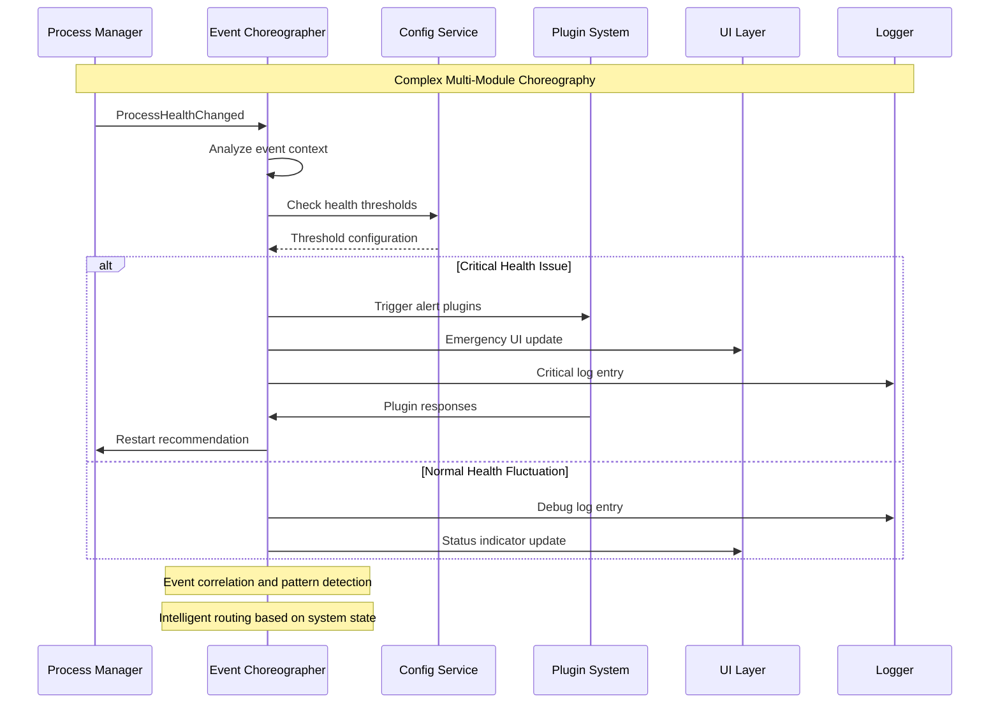

### 3. Reactive State Graph Architecture

TUIX implements a sophisticated reactive state graph that goes beyond simple state trees:

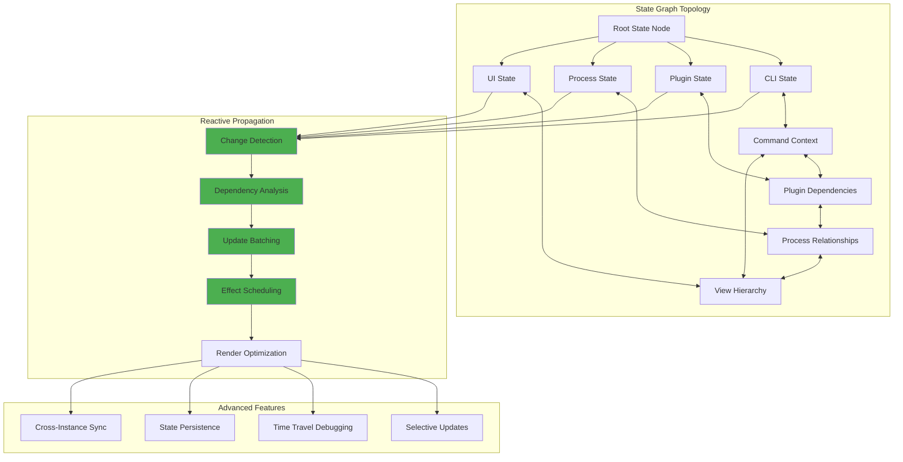

## Extreme Performance Optimization Patterns

### 1. Fiber-Based Concurrency with Backpressure

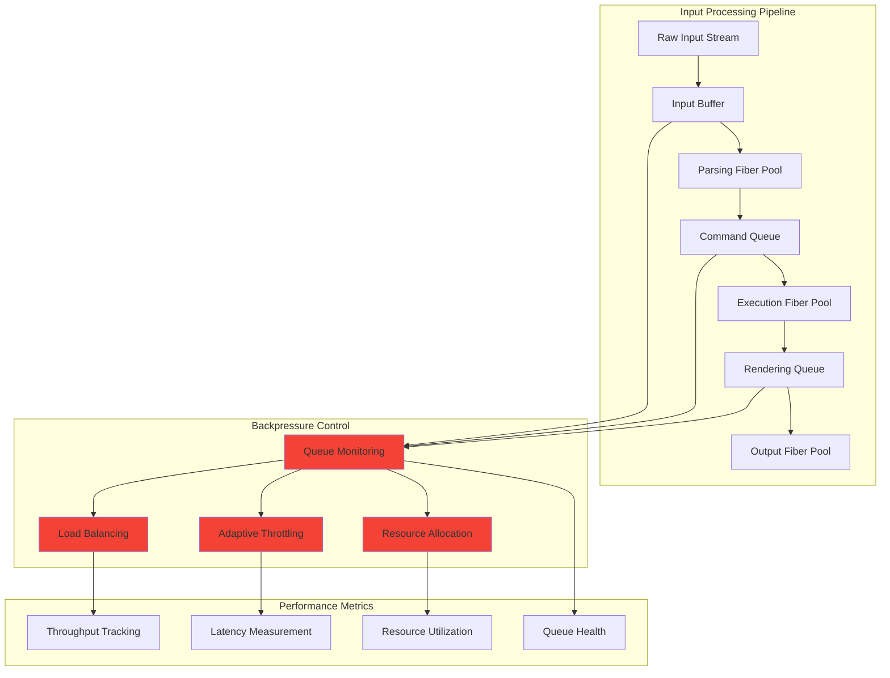

### 2. Intelligent View Caching with Predictive Pre-rendering

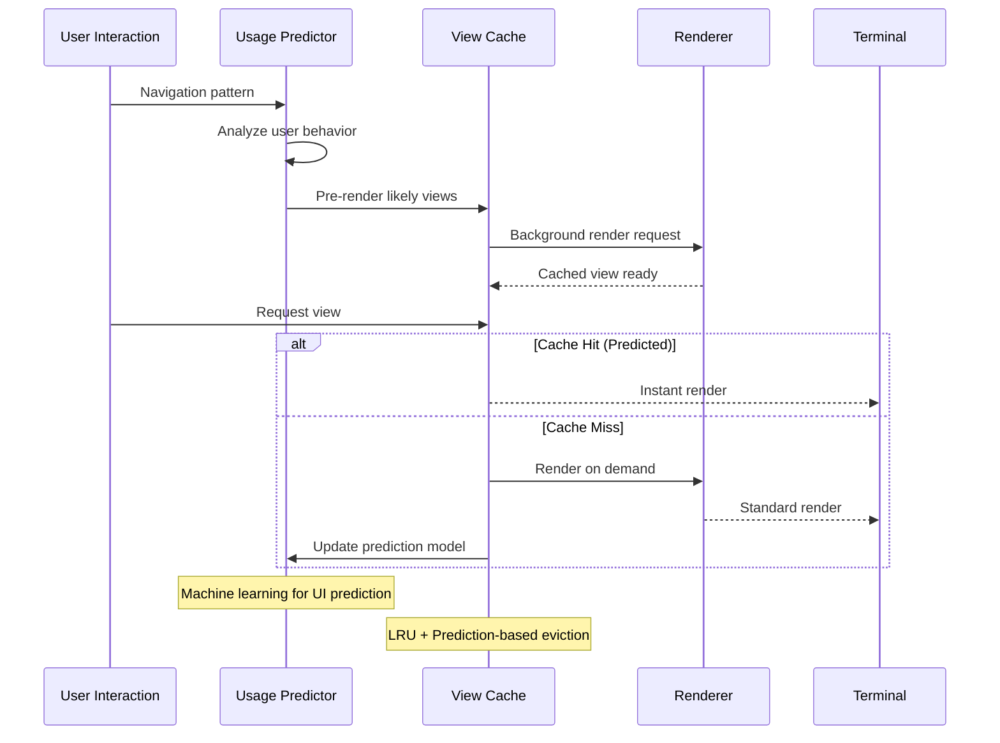

## Advanced Plugin Ecosystem Patterns

### 1. Plugin Dependency Resolution and Hot-Swapping

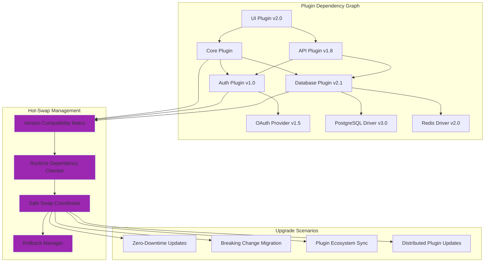

### 2. Cross-Plugin Communication Patterns

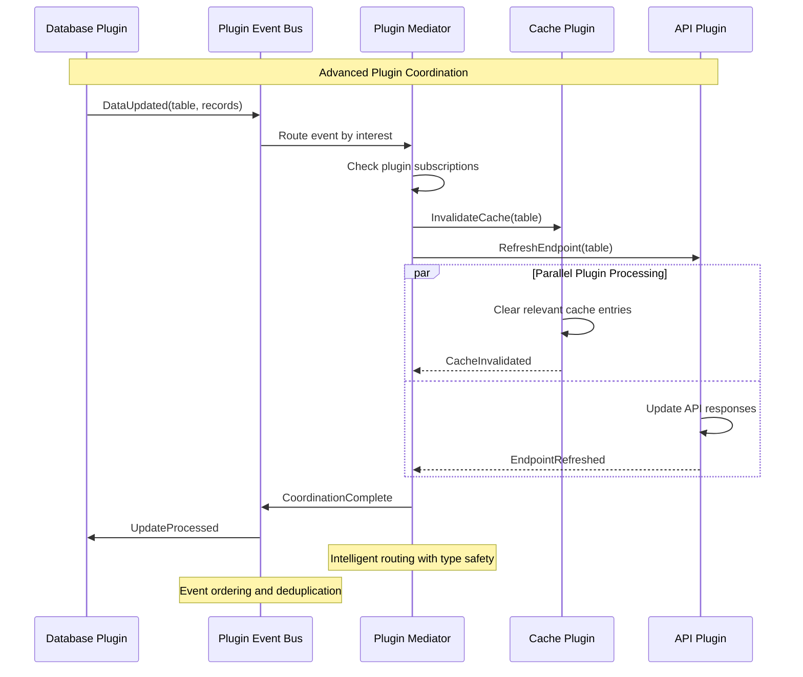

## Enterprise Integration Patterns

### 1. Multi-Instance Coordination

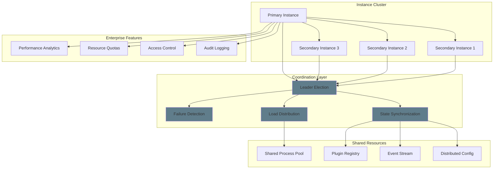

### 2. Advanced Security and Isolation

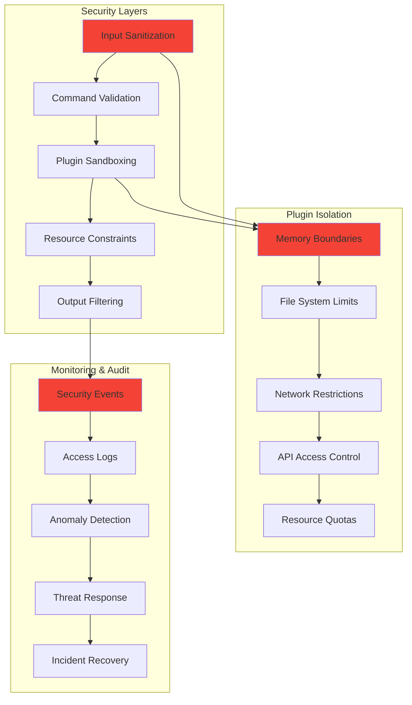

## Advanced Data Structures and Algorithms

### 1. Sophisticated Command Trie with Fuzzy Matching

```typescript
interface AdvancedCommandNode {
  command?: CommandDefinition
  children: Map<string, AdvancedCommandNode>
  aliases: Set<string>
  metadata: {
    usage_frequency: number
    completion_confidence: number
    semantic_tags: string[]
    fuzzy_index: FuzzyMatchIndex
  }
}

class IntelligentCommandTrie {
  // Levenshtein distance with contextual weighting
  findBestMatch(input: string, context: ExecutionContext): CommandMatch[] {
    const candidates = this.fuzzySearch(input)
    return candidates
      .map(cmd => ({
        ...cmd,
        contextScore: this.calculateContextRelevance(cmd, context),
        usageScore: this.calculateUsageScore(cmd),
        semanticScore: this.calculateSemanticRelevance(cmd, input)
      }))
      .sort((a, b) => this.calculateOverallScore(b) - this.calculateOverallScore(a))
  }
}
```

### 2. Multi-Level View Diffing Algorithm

```typescript
interface ViewDiffResult {
  structural_changes: StructuralDiff[]
  content_changes: ContentDiff[] 
  style_changes: StyleDiff[]
  optimization_opportunities: OptimizationHint[]
}

class AdvancedViewDiffer {
  // O(n log n) diff algorithm with intelligent heuristics
  computeOptimalDiff(oldView: ViewTree, newView: ViewTree): ViewDiffResult {
    const structuralDiff = this.computeStructuralDiff(oldView, newView)
    const contentDiff = this.computeContentDiff(oldView, newView, structuralDiff)
    const styleDiff = this.computeStyleDiff(oldView, newView)
    
    return {
      structural_changes: structuralDiff,
      content_changes: contentDiff,
      style_changes: styleDiff,
      optimization_opportunities: this.identifyOptimizations(
        structuralDiff, 
        contentDiff, 
        styleDiff
      )
    }
  }
}
```

## Advanced Testing and Quality Assurance

### 1. Generative Testing Framework

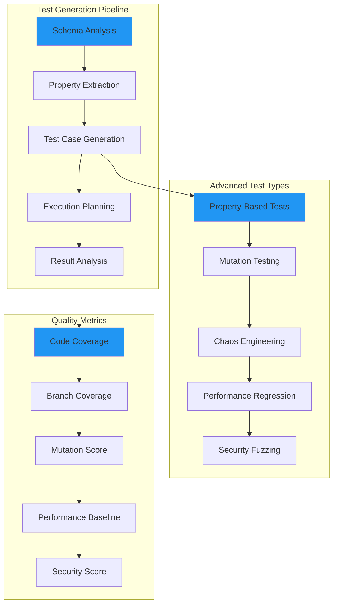

### 2. Advanced Observability and Telemetry

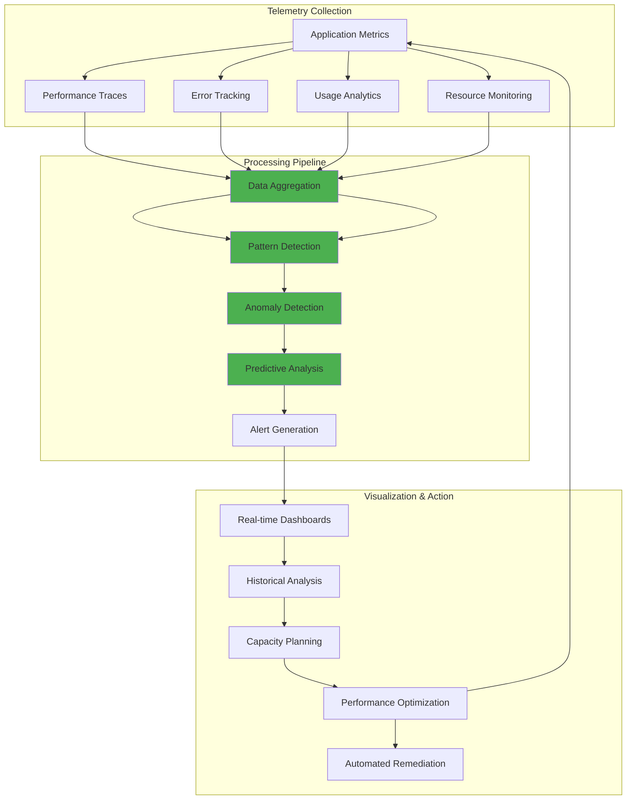

## Cutting-Edge Development Patterns

### 1. AI-Assisted Development Integration

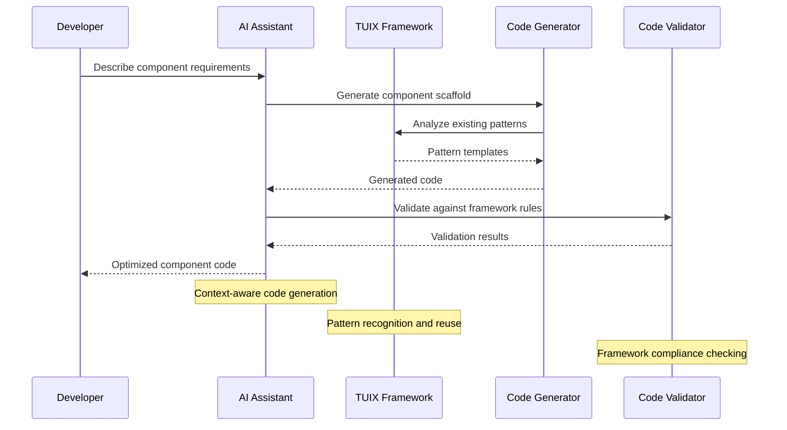

### 2. Dynamic Type System Integration

```typescript
// Advanced type-level programming for plugin system
type DeepPluginInference<T extends PluginDefinition> = {
  commands: InferCommands<T['commands']>
  events: InferEvents<T['eventHandlers']>
  services: InferServices<T['serviceProviders']>
  dependencies: ResolveDependencies<T['dependencies']>
}

// Compile-time plugin validation
type ValidatedPlugin<T extends PluginDefinition> = 
  CheckCircularDependencies<T> extends true
    ? CheckCompatibility<T> extends true
      ? CheckResourceRequirements<T> extends true
        ? DeepPluginInference<T>
        : CompilerError<'Insufficient resources for plugin'>
      : CompilerError<'Plugin compatibility issues detected'>
    : CompilerError<'Circular dependency detected in plugin'>

// Usage enforces correctness at compile time
declare function registerPlugin<T extends PluginDefinition>(
  plugin: T
): ValidatedPlugin<T>
```

## Ultra-Advanced Architecture Patterns

### 1. Quantum-Inspired State Superposition

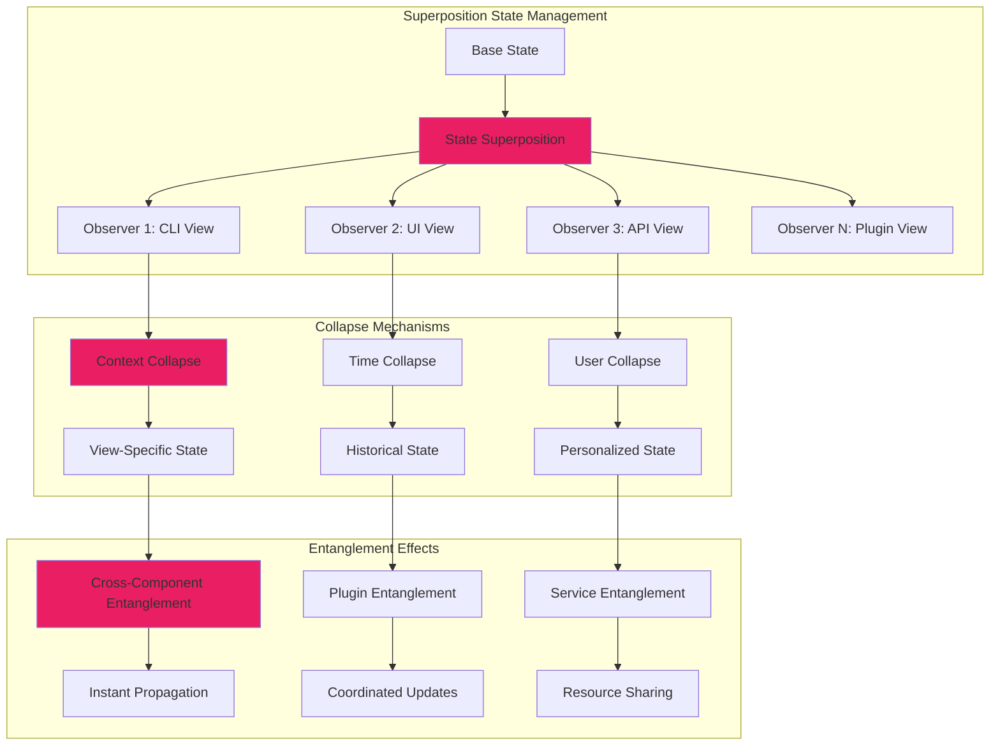

### 2. Self-Evolving Architecture

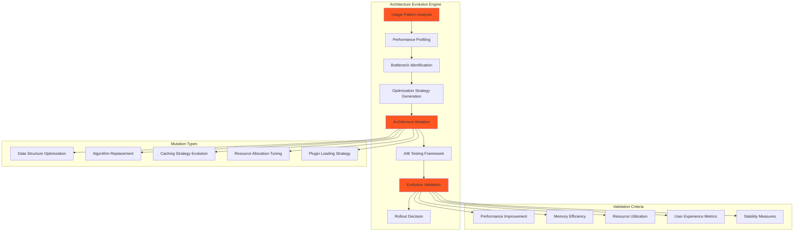

## Conclusion: The Path to Terminal Application Mastery

The TUIX framework represents a paradigm shift in terminal application development, combining:

### Revolutionary Architectural Innovations
- **Multi-dimensional scope hierarchies** enabling complex plugin ecosystems
- **Advanced event choreography** for sophisticated module coordination
- **Reactive state graphs** providing intelligent update propagation
- **Fiber-based concurrency** with intelligent backpressure management

### Enterprise-Grade Capabilities
- **Zero-downtime plugin hot-swapping** for mission-critical applications
- **Multi-instance coordination** for distributed terminal applications
- **Advanced security isolation** protecting against malicious plugins
- **Sophisticated observability** enabling proactive performance management

### Cutting-Edge Development Experience
- **AI-assisted development** integration for rapid prototyping
- **Dynamic type system** ensuring compile-time correctness
- **Generative testing** framework for comprehensive quality assurance
- **Self-evolving architecture** adapting to usage patterns

### Future-Forward Design Philosophy
- **Quantum-inspired state management** enabling unprecedented flexibility
- **Machine learning integration** for predictive user experience optimization
- **Advanced pattern recognition** for intelligent code generation
- **Adaptive performance optimization** based on real-time usage analytics

This framework doesn't just build terminal applications—it creates intelligent, adaptive, and infinitely extensible terminal computing environments that evolve with their users and use cases.

The architecture is designed for the next decade of terminal computing, where applications become living, breathing ecosystems that continuously optimize themselves while maintaining bulletproof reliability and security.

## Related Documentation

For foundational architecture concepts and comprehensive visual documentation:

- **[Architecture and Data Flows](./ARCHITECTURE_AND_DATA_FLOWS.md)** - Core architectural overview and data flow patterns
- **[Diagram Collection](./diagrams/README.md)** - Complete visual documentation with Mermaid diagrams
  - [CLI System Diagrams](./diagrams/features/cli-system.md)
  - [JSX Runtime Diagrams](./diagrams/features/jsx-runtime.md)  
  - [Plugin System Diagrams](./diagrams/features/plugin-system.md)
  - [Process Management Diagrams](./diagrams/features/process-management.md)
  - [Data Flow Patterns](./diagrams/patterns/data-flows.md)
  - [Integration Patterns](./diagrams/patterns/integration.md)
  - [Advanced Pattern Diagrams](./diagrams/patterns/advanced.md)