# TUIX Framework Architecture and Data Flow Analysis

## Overview

This document provides a comprehensive analysis of the TUIX framework architecture, documenting the distinct usage patterns, data flows, and integration points across all modules. The framework implements a sophisticated Model-View-Update (MVU) architecture enhanced with Effect.ts for type-safe, composable terminal applications.

## Core Architecture Principles

### 1. MVU (Model-View-Update) Pattern
- **Model**: Immutable application state managed via typed stores
- **View**: Pure rendering functions producing terminal output
- **Update**: State transition functions triggered by messages
- **Commands**: Asynchronous side effects producing messages  
- **Subscriptions**: Continuous streams of external events

### 2. Effect.ts Integration
- Comprehensive error handling with typed error channels
- Resource-safe operations with automatic cleanup
- Dependency injection through Context system
- Structured concurrency with fiber management

### 3. Service-Oriented Architecture
- Terminal operations abstracted via TerminalService
- Input handling through InputService
- Rendering pipeline via RendererService
- Persistent storage via StorageService

## System Architecture Overview

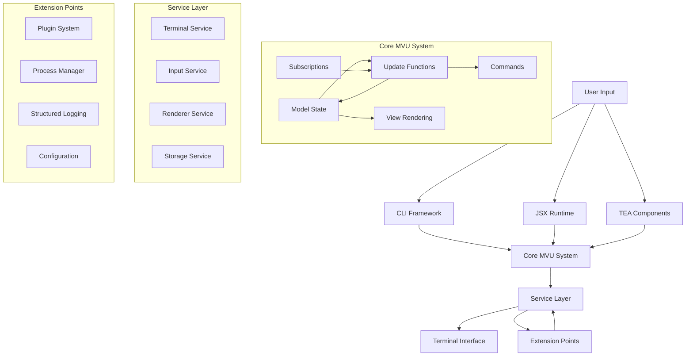
```mermaid
graph TB
    User[User Input] --> CLI[CLI Framework]
    User --> JSX[JSX Runtime]
    User --> TEA[TEA Components]
    
    CLI --> Core[Core MVU System]
    JSX --> Core
    TEA --> Core
    
    Core --> Services[Service Layer]
    Services --> Terminal[Terminal Interface]
    
    subgraph "Core MVU System"
        Model[Model State]
        Update[Update Functions]  
        View[View Rendering]
        Cmd[Commands]
        Sub[Subscriptions]
        
        Model --> Update
        Update --> Model
        Update --> Cmd
        Model --> View
        Sub --> Update
    end
    
    subgraph "Service Layer"
        TerminalService[Terminal Service]
        InputService[Input Service] 
        RendererService[Renderer Service]
        StorageService[Storage Service]
    end
    
    subgraph "Extension Points"
        Plugins[Plugin System]
        ProcessMgr[Process Manager]
        Logger[Structured Logging]
        Config[Configuration]
    end
    
    Services --> Extension[Extension Points]
    Extension --> Services
```

## Data Flow Patterns

### Pattern 1: CLI Application Execution

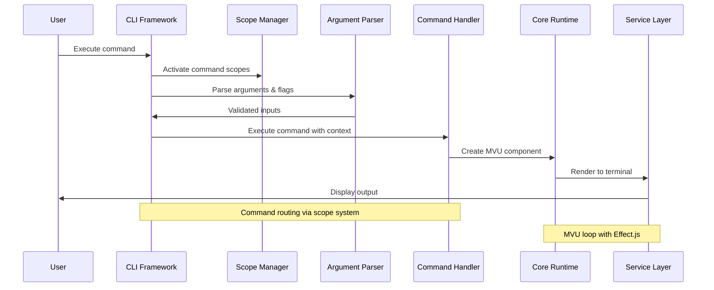
```mermaid
sequenceDiagram
    participant User
    participant CLI as CLI Framework
    participant Scope as Scope Manager
    participant Parser as Argument Parser
    participant Handler as Command Handler
    participant Core as Core Runtime
    participant Services as Service Layer
    
    User->>CLI: Execute command
    CLI->>Scope: Activate command scopes
    CLI->>Parser: Parse arguments & flags
    Parser->>CLI: Validated inputs
    CLI->>Handler: Execute command with context
    Handler->>Core: Create MVU component
    Core->>Services: Render to terminal
    Services->>User: Display output
    
    Note over CLI,Handler: Command routing via scope system
    Note over Core,Services: MVU loop with Effect.js
```

### Pattern 2: JSX Component Rendering

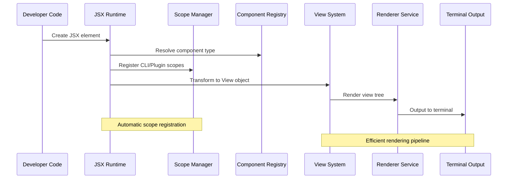
```mermaid
sequenceDiagram
    participant Developer as Developer Code
    participant JSX as JSX Runtime
    participant Scope as Scope Manager
    participant Registry as Component Registry
    participant View as View System
    participant Renderer as Renderer Service
    participant Terminal as Terminal Output
    
    Developer->>JSX: Create JSX element
    JSX->>Registry: Resolve component type
    JSX->>Scope: Register CLI/Plugin scopes
    JSX->>View: Transform to View object
    View->>Renderer: Render view tree
    Renderer->>Terminal: Output to terminal
    
    Note over JSX,Scope: Automatic scope registration
    Note over View,Terminal: Efficient rendering pipeline
```

### Pattern 3: Process Management Integration

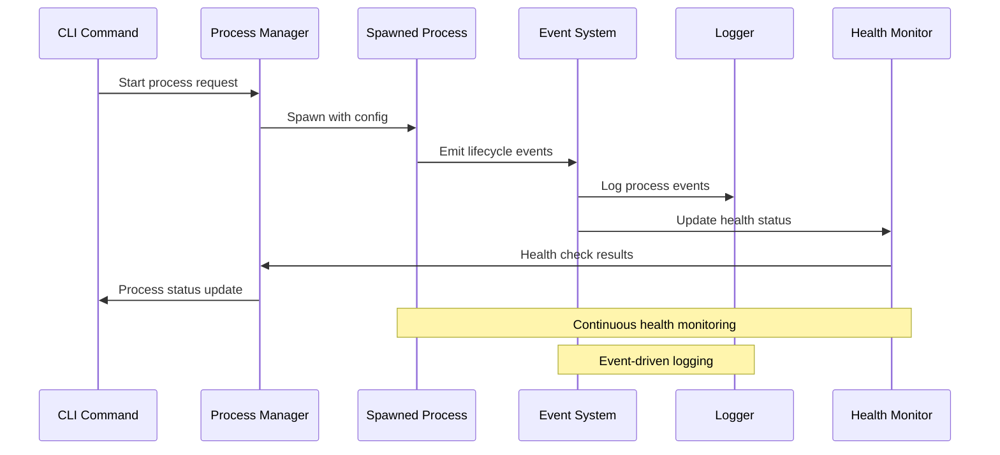
```mermaid
sequenceDiagram
    participant CLI as CLI Command
    participant PM as Process Manager
    participant Process as Spawned Process
    participant Events as Event System
    participant Logger as Logger
    participant Monitor as Health Monitor
    
    CLI->>PM: Start process request
    PM->>Process: Spawn with config
    Process->>Events: Emit lifecycle events
    Events->>Logger: Log process events
    Events->>Monitor: Update health status
    Monitor->>PM: Health check results
    PM->>CLI: Process status update
    
    Note over Process,Monitor: Continuous health monitoring
    Note over Events,Logger: Event-driven logging
```

### Pattern 4: Plugin System Architecture

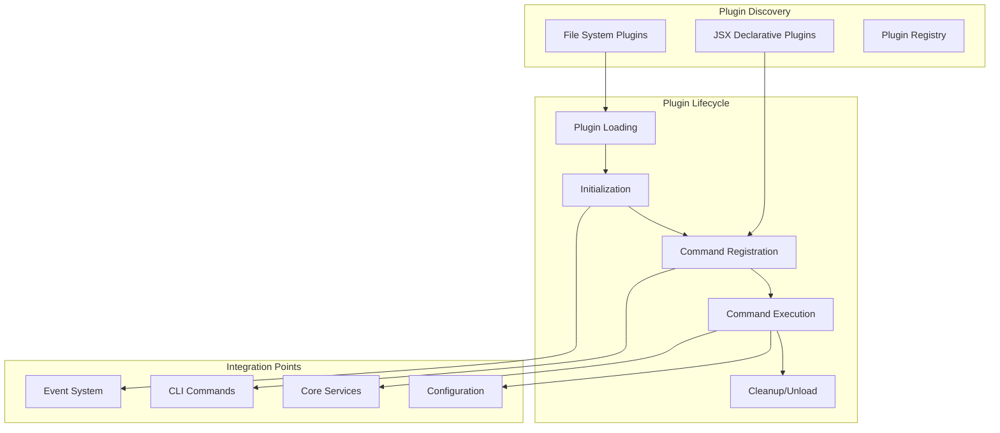
```mermaid
graph TB
    subgraph "Plugin Discovery"
        FileSystem[File System Plugins]
        Declarative[JSX Declarative Plugins]
        Registry[Plugin Registry]
    end
    
    subgraph "Plugin Lifecycle"
        Load[Plugin Loading]
        Init[Initialization]
        Register[Command Registration]  
        Execute[Command Execution]
        Cleanup[Cleanup/Unload]
    end
    
    subgraph "Integration Points"
        CLI[CLI Commands]
        Events[Event System]
        Config[Configuration]
        Services[Core Services]
    end
    
    FileSystem --> Load
    Declarative --> Register
    Load --> Init
    Init --> Register
    Register --> Execute
    Execute --> Cleanup
    
    Register --> CLI
    Init --> Events
    Execute --> Config
    Execute --> Services
```

## Usage Pattern Analysis

### 1. Simple CLI Application

**Data Flow:**
User Command → CLI Parser → Command Handler → Terminal Output

```typescript
// User executes: myapp build --target production
// Flow: ['build'] → parseArgs({target: 'production'}) → buildHandler → terminal output
```

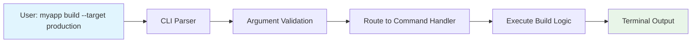
```mermaid
flowchart LR
    A[User: myapp build --target production] --> B[CLI Parser]
    B --> C[Argument Validation]
    C --> D[Route to Command Handler] 
    D --> E[Execute Build Logic]
    E --> F[Terminal Output]
    
    style A fill:#e1f5fe
    style F fill:#e8f5e8
```

### 2. Interactive JSX Application

**Data Flow:**
JSX Elements → Component Registry → View Tree → Renderer → Terminal UI

```mermaid
flowchart TB
    A[JSX Component Definition] --> B[jsx() Function Call]
    B --> C[Component Registry Resolution]
    C --> D[Scope Registration]
    D --> E[View Tree Construction]
    E --> F[Renderer Service]
    F --> G[Terminal UI Output]
    
    subgraph "Runtime Processing"
        H[State Management]
        I[Event Handling]
        J[Re-rendering]
    end
    
    E --> H
    H --> I
    I --> J
    J --> E
    
    style A fill:#fff3e0
    style G fill:#e8f5e8
```

### 3. Plugin-Extensible Application

**Data Flow:**
Plugin Definition → Registration → Command Integration → CLI Execution

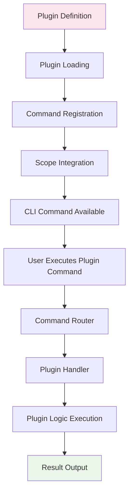
```mermaid
flowchart TD
    A[Plugin Definition] --> B[Plugin Loading]
    B --> C[Command Registration]
    C --> D[Scope Integration]
    D --> E[CLI Command Available]
    
    F[User Executes Plugin Command] --> G[Command Router]
    G --> H[Plugin Handler]
    H --> I[Plugin Logic Execution]
    I --> J[Result Output]
    
    E --> F
    
    style A fill:#fce4ec
    style J fill:#e8f5e8
```

### 4. Process Management Application

**Data Flow:**
Process Config → Process Manager → Health Monitoring → Event Choreography

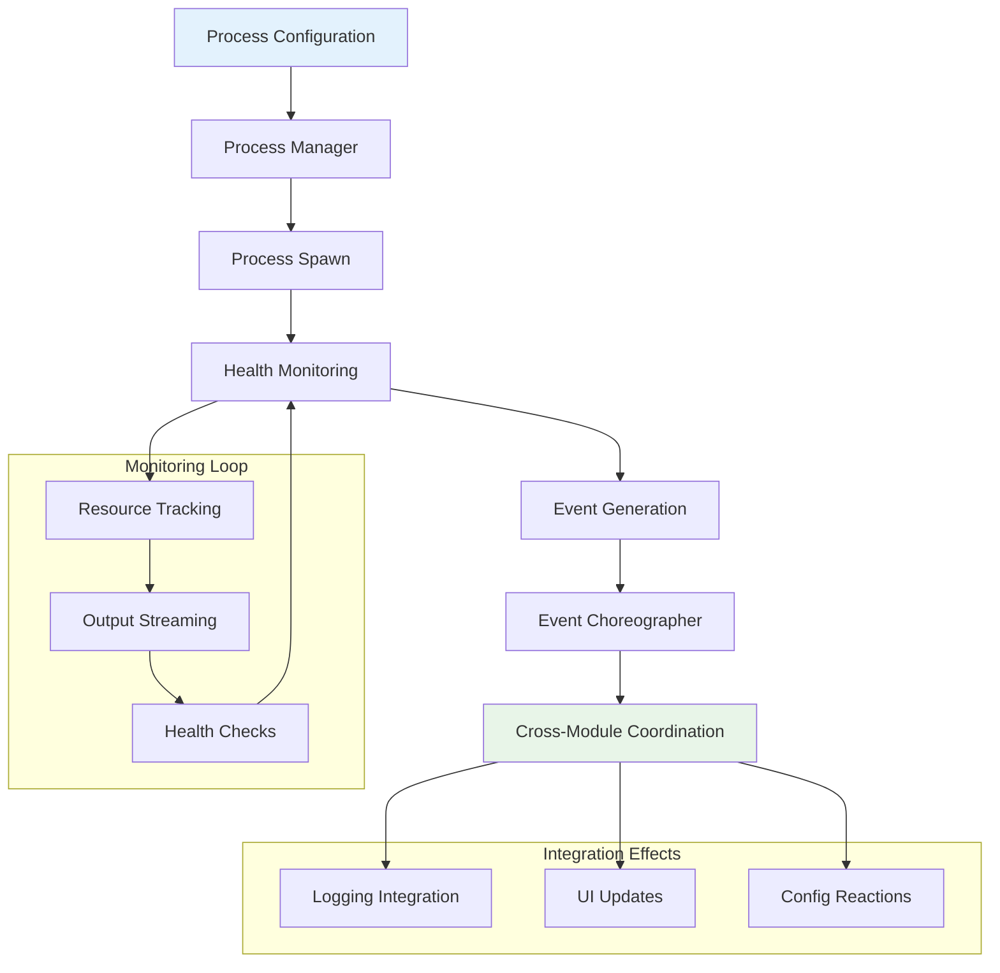
```mermaid
flowchart TB
    A[Process Configuration] --> B[Process Manager]
    B --> C[Process Spawn]
    C --> D[Health Monitoring]
    D --> E[Event Generation]
    E --> F[Event Choreographer]
    F --> G[Cross-Module Coordination]
    
    subgraph "Monitoring Loop"
        H[Resource Tracking]
        I[Output Streaming]
        J[Health Checks]
    end
    
    D --> H
    H --> I
    I --> J
    J --> D
    
    subgraph "Integration Effects"
        K[Logging Integration]
        L[UI Updates]
        M[Config Reactions]
    end
    
    G --> K
    G --> L  
    G --> M
    
    style A fill:#e3f2fd
    style G fill:#e8f5e8
```

## Module Integration Patterns

### 1. CLI ↔ JSX Integration

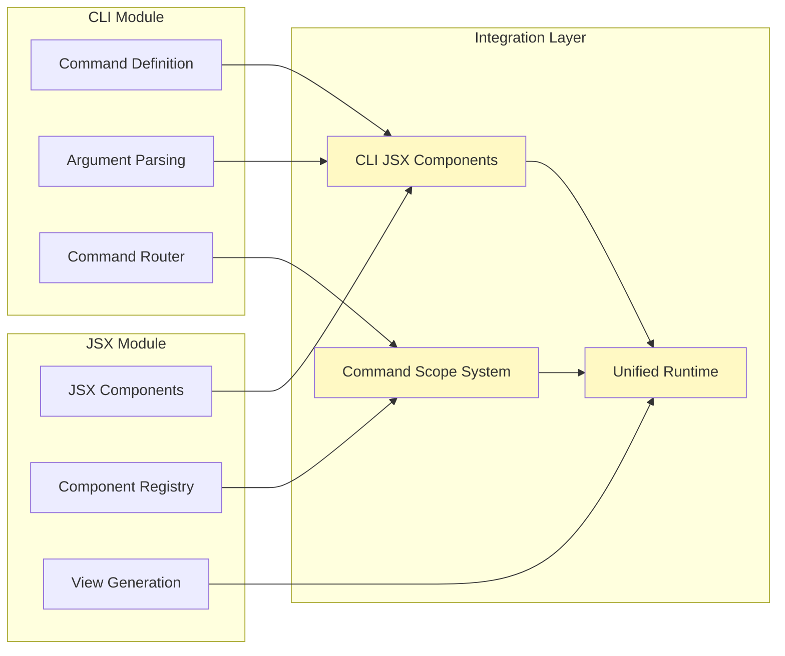
```mermaid
graph LR
    subgraph "CLI Module"
        A[Command Definition]
        B[Argument Parsing]
        C[Command Router]
    end
    
    subgraph "JSX Module"  
        D[JSX Components]
        E[Component Registry]
        F[View Generation]
    end
    
    subgraph "Integration Layer"
        G[CLI JSX Components]
        H[Command Scope System]
        I[Unified Runtime]
    end
    
    A --> G
    B --> G
    C --> H
    D --> G
    E --> H
    F --> I
    G --> I
    H --> I
    
    style G fill:#fff9c4
    style H fill:#fff9c4
    style I fill:#fff9c4
```

### 2. Core Services Integration

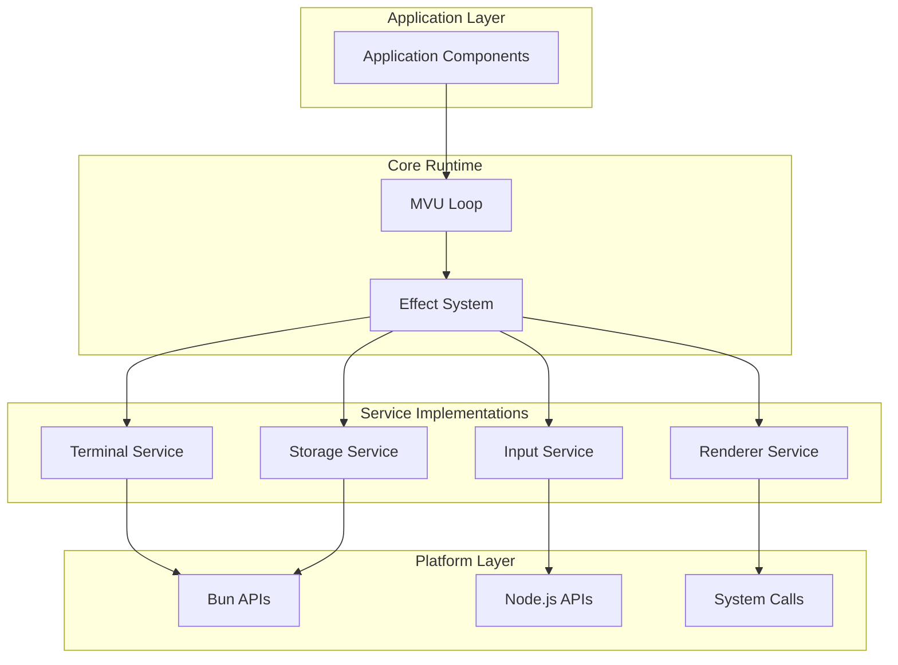
```mermaid
graph TB
    subgraph "Application Layer"
        App[Application Components]
    end
    
    subgraph "Core Runtime"
        MVU[MVU Loop]
        Effect[Effect System]
    end
    
    subgraph "Service Implementations"
        Terminal[Terminal Service]
        Input[Input Service] 
        Renderer[Renderer Service]
        Storage[Storage Service]
    end
    
    subgraph "Platform Layer"
        BunAPI[Bun APIs]
        NodeAPI[Node.js APIs]
        SystemCalls[System Calls]
    end
    
    App --> MVU
    MVU --> Effect
    Effect --> Terminal
    Effect --> Input
    Effect --> Renderer
    Effect --> Storage
    
    Terminal --> BunAPI
    Input --> NodeAPI
    Renderer --> SystemCalls
    Storage --> BunAPI
```

### 3. Event System Architecture

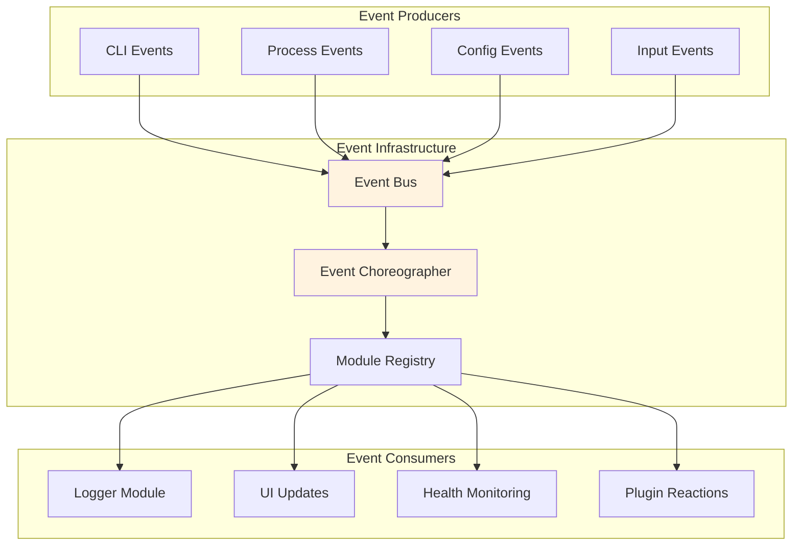
```mermaid
graph TB
    subgraph "Event Producers"
        CLI[CLI Events]
        Process[Process Events]
        Config[Config Events]
        Input[Input Events]
    end
    
    subgraph "Event Infrastructure"
        Bus[Event Bus]
        Choreographer[Event Choreographer]
        Registry[Module Registry]
    end
    
    subgraph "Event Consumers"
        Logger[Logger Module]
        UI[UI Updates]
        Monitoring[Health Monitoring] 
        Plugins[Plugin Reactions]
    end
    
    CLI --> Bus
    Process --> Bus
    Config --> Bus
    Input --> Bus
    
    Bus --> Choreographer
    Choreographer --> Registry
    
    Registry --> Logger
    Registry --> UI
    Registry --> Monitoring
    Registry --> Plugins
    
    style Bus fill:#fff3e0
    style Choreographer fill:#fff3e0
```

## Advanced Usage Patterns

### 1. Multi-Modal Applications (CLI + Interactive UI)

Applications that provide both command-line interface and interactive terminal UI modes.

**Architecture:**
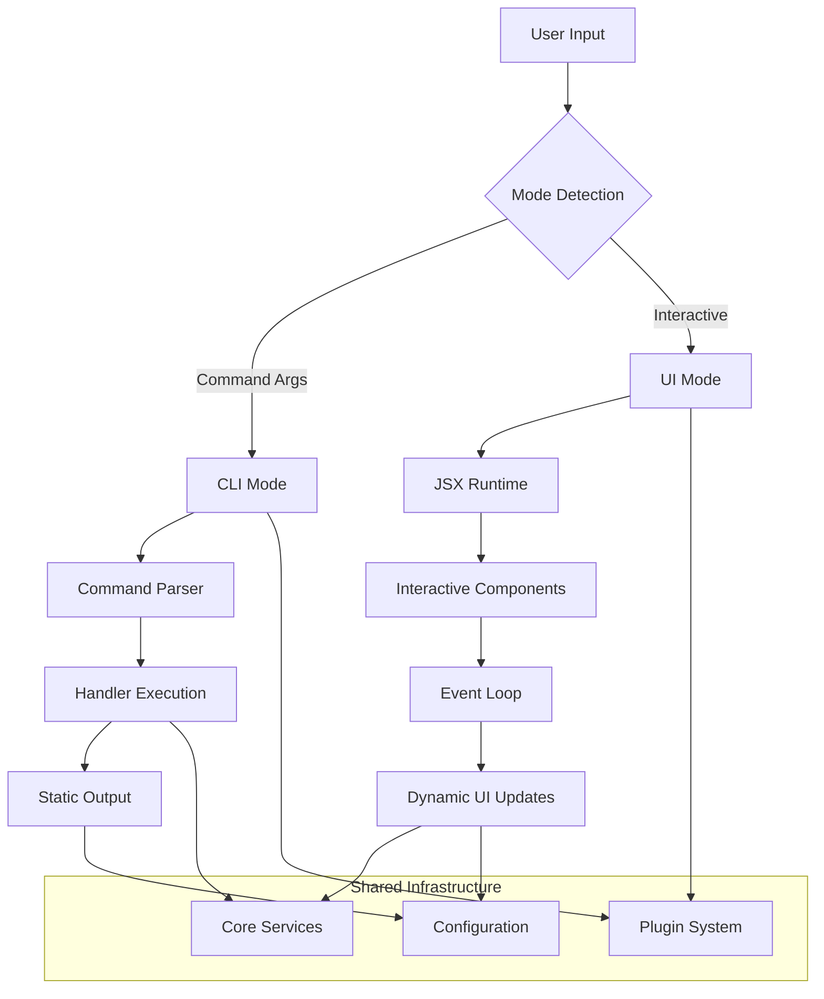
```mermaid
flowchart TB
    A[User Input] --> B{Mode Detection}
    B -->|Command Args| C[CLI Mode]
    B -->|Interactive| D[UI Mode]
    
    C --> E[Command Parser]
    E --> F[Handler Execution]
    F --> G[Static Output]
    
    D --> H[JSX Runtime]  
    H --> I[Interactive Components]
    I --> J[Event Loop]
    J --> K[Dynamic UI Updates]
    
    subgraph "Shared Infrastructure"
        L[Core Services]
        M[Plugin System]
        N[Configuration]
    end
    
    F --> L
    K --> L
    C --> M
    D --> M
    G --> N
    K --> N
```

**Use Case:**
A development tool that can run commands directly (`dev build`) or provide an interactive dashboard (`dev dashboard`).

### 2. Plugin Orchestration Workflows

Complex workflows that coordinate multiple plugins with dependencies and error handling.

**Architecture:**  
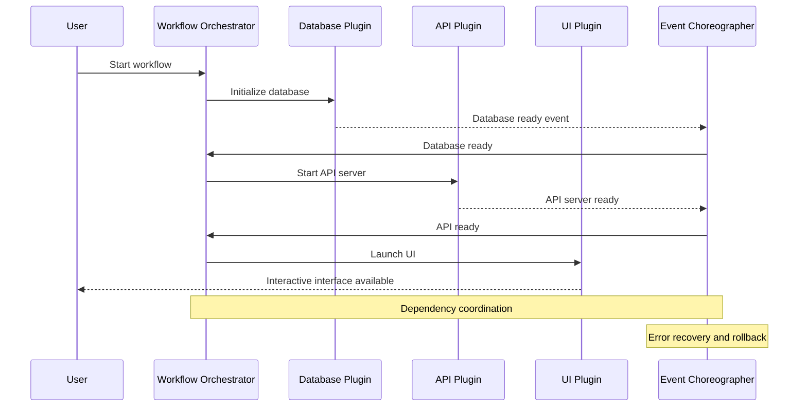
```mermaid
sequenceDiagram
    participant User
    participant Orchestrator as Workflow Orchestrator
    participant PluginA as Database Plugin
    participant PluginB as API Plugin
    participant PluginC as UI Plugin
    participant Events as Event Choreographer
    
    User->>Orchestrator: Start workflow
    Orchestrator->>PluginA: Initialize database
    PluginA-->>Events: Database ready event
    Events->>Orchestrator: Database ready
    Orchestrator->>PluginB: Start API server
    PluginB-->>Events: API server ready
    Events->>Orchestrator: API ready
    Orchestrator->>PluginC: Launch UI
    PluginC-->>User: Interactive interface available
    
    Note over Orchestrator,Events: Dependency coordination
    Note over Events: Error recovery and rollback
```

### 3. Real-Time Monitoring Applications

Applications that continuously monitor processes and provide live updates.

**Data Flow:**
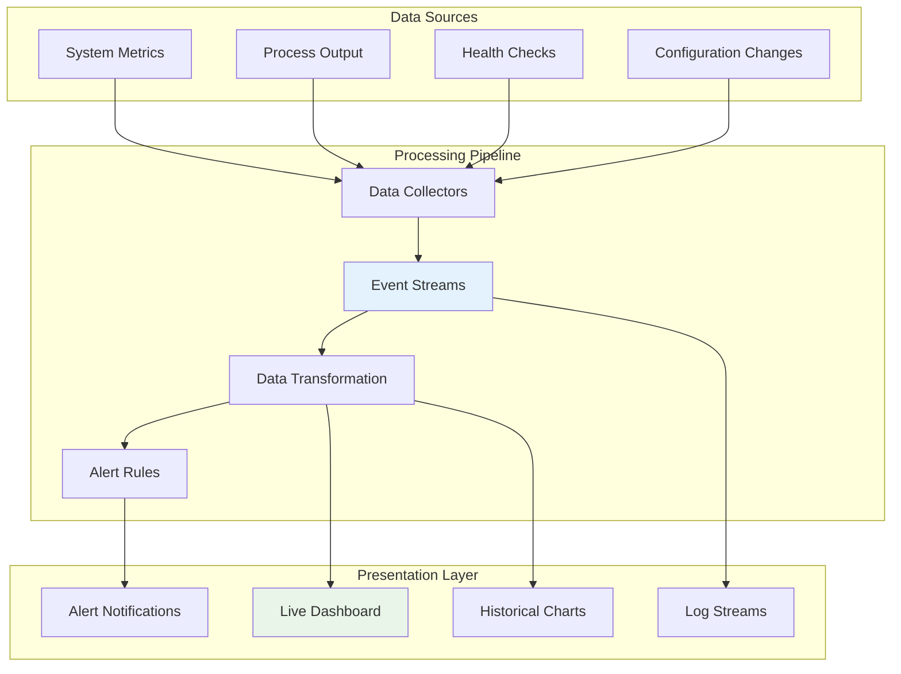
```mermaid
flowchart TB
    subgraph "Data Sources"
        A[System Metrics]
        B[Process Output]
        C[Health Checks]
        D[Configuration Changes]
    end
    
    subgraph "Processing Pipeline"
        E[Data Collectors]
        F[Event Streams]
        G[Data Transformation]
        H[Alert Rules]
    end
    
    subgraph "Presentation Layer"
        I[Live Dashboard]
        J[Log Streams] 
        K[Alert Notifications]
        L[Historical Charts]
    end
    
    A --> E
    B --> E
    C --> E  
    D --> E
    
    E --> F
    F --> G
    G --> H
    
    G --> I
    F --> J
    H --> K
    G --> L
    
    style F fill:#e3f2fd
    style I fill:#e8f5e8
```

## Performance and Optimization Patterns

### 1. Lazy Loading and Code Splitting

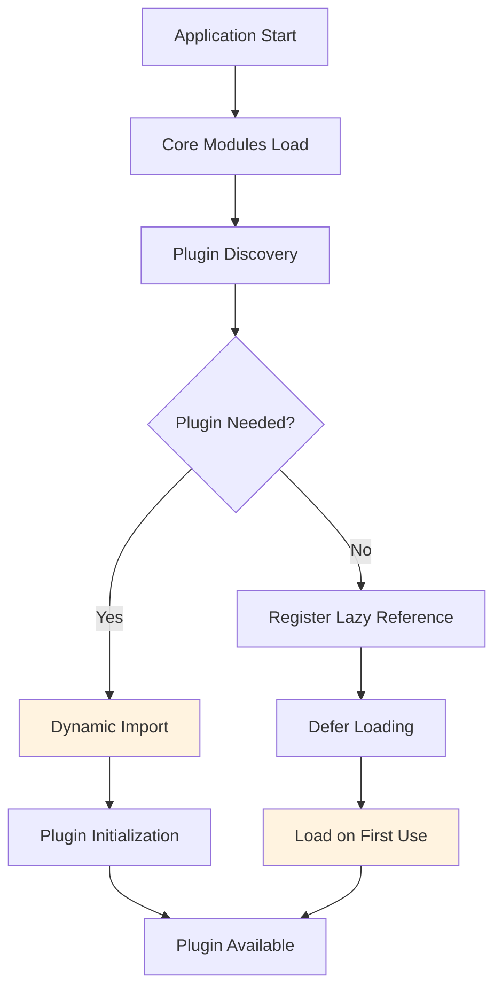
```mermaid
graph TB
    A[Application Start] --> B[Core Modules Load]
    B --> C[Plugin Discovery]
    C --> D{Plugin Needed?}
    
    D -->|Yes| E[Dynamic Import]
    D -->|No| F[Register Lazy Reference]
    
    E --> G[Plugin Initialization]
    F --> H[Defer Loading]
    
    G --> I[Plugin Available]
    H --> J[Load on First Use]
    J --> I
    
    style E fill:#fff3e0
    style J fill:#fff3e0
```

### 2. Caching and Memoization

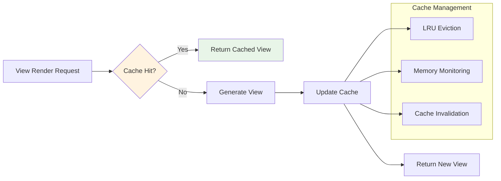
```mermaid
flowchart LR
    A[View Render Request] --> B{Cache Hit?}
    B -->|Yes| C[Return Cached View]
    B -->|No| D[Generate View]
    D --> E[Update Cache]
    E --> F[Return New View]
    
    subgraph "Cache Management"
        G[LRU Eviction]
        H[Memory Monitoring]
        I[Cache Invalidation]
    end
    
    E --> G
    E --> H
    E --> I
    
    style B fill:#fff3e0
    style C fill:#e8f5e8
```

## Error Handling and Recovery

### 1. Error Boundary System

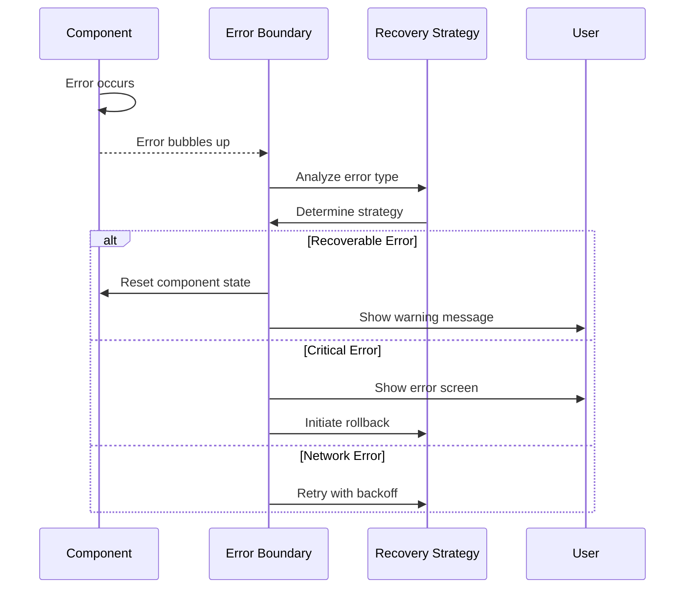
```mermaid
sequenceDiagram
    participant Component
    participant Boundary as Error Boundary
    participant Recovery as Recovery Strategy
    participant User
    
    Component->>Component: Error occurs
    Component-->>Boundary: Error bubbles up
    Boundary->>Recovery: Analyze error type
    Recovery->>Boundary: Determine strategy
    
    alt Recoverable Error
        Boundary->>Component: Reset component state
        Boundary->>User: Show warning message
    else Critical Error
        Boundary->>User: Show error screen
        Boundary->>Recovery: Initiate rollback
    else Network Error
        Boundary->>Recovery: Retry with backoff
    end
```

### 2. Resource Cleanup Patterns

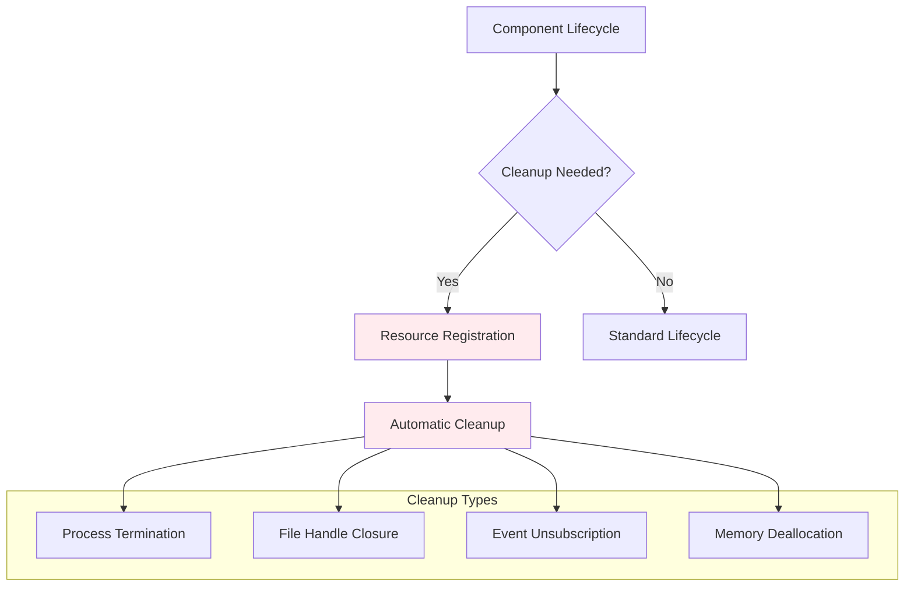
```mermaid
flowchart TD
    A[Component Lifecycle] --> B{Cleanup Needed?}
    B -->|Yes| C[Resource Registration]
    C --> D[Automatic Cleanup]
    B -->|No| E[Standard Lifecycle]
    
    subgraph "Cleanup Types"
        F[Process Termination]
        G[File Handle Closure]
        H[Event Unsubscription]
        I[Memory Deallocation]
    end
    
    D --> F
    D --> G
    D --> H
    D --> I
    
    style C fill:#ffebee
    style D fill:#ffebee
```

## Configuration and Extensibility

### 1. Configuration Flow

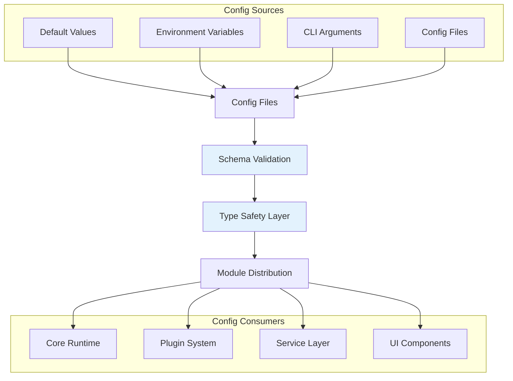
```mermaid
flowchart TB
    A[Config Files] --> B[Schema Validation]
    B --> C[Type Safety Layer]
    C --> D[Module Distribution]
    
    subgraph "Config Sources"
        E[Default Values]
        F[Environment Variables]
        G[CLI Arguments]
        H[Config Files]
    end
    
    E --> A
    F --> A
    G --> A
    H --> A
    
    subgraph "Config Consumers"
        I[Core Runtime]
        J[Plugin System]
        K[Service Layer]
        L[UI Components]
    end
    
    D --> I
    D --> J
    D --> K
    D --> L
    
    style B fill:#e3f2fd
    style C fill:#e3f2fd
```

### 2. Plugin Extension Points

```mermaid
graph TB
    subgraph "Core Extension Points"
        A[Command Registration]
        B[Event Hooks]
        C[Service Providers]
        D[UI Components]
    end
    
    subgraph "Plugin Capabilities"
        E[Custom Commands]
        F[Event Listeners]
        G[Service Implementations] 
        H[Custom Views]
    end
    
    subgraph "Integration Mechanisms"
        I[Scope System]
        J[Event Bus]
        K[Service Registry]
        L[Component Registry]
    end
    
    A --> I
    B --> J
    C --> K
    D --> L
    
    E --> I
    F --> J
    G --> K
    H --> L
    
    style I fill:#fff3e0
    style J fill:#fff3e0
    style K fill:#fff3e0
    style L fill:#fff3e0
```

## Testing Patterns

### 1. Component Testing

```mermaid
flowchart LR
    A[Test Setup] --> B[Mock Services]
    B --> C[Component Creation]
    C --> D[State Manipulation]
    D --> E[Assertion Checks]
    
    subgraph "Test Utilities"
        F[Service Mocks]
        G[Event Simulation]
        H[State Snapshots]
        I[Output Capture]
    end
    
    B --> F
    C --> G
    D --> H
    E --> I
```

### 2. Integration Testing

```mermaid
sequenceDiagram
    participant Test as Test Suite
    participant App as Application
    participant Services as Real Services
    participant Terminal as Test Terminal
    
    Test->>App: Start application
    App->>Services: Initialize services
    Services->>Terminal: Create test terminal
    Test->>App: Send input commands
    App->>Terminal: Process and render
    Terminal->>Test: Capture output
    Test->>Test: Verify expected output
```

## Deployment and Distribution

### 1. Application Packaging

```mermaid
flowchart TB
    A[Source Code] --> B[Build Process]
    B --> C[Bundle Generation]
    C --> D[Asset Optimization]
    D --> E[Distribution Package]
    
    subgraph "Build Steps"
        F[TypeScript Compilation]
        G[Dependency Resolution]
        H[Code Splitting]
        I[Asset Bundling]
    end
    
    B --> F
    B --> G
    B --> H
    B --> I
    
    subgraph "Distribution Formats"
        J[Standalone Binary]
        K[NPM Package]
        L[Container Image]
        M[Platform Installer]
    end
    
    E --> J
    E --> K
    E --> L
    E --> M
```

## Detailed Diagrams

For comprehensive visual documentation of specific features and patterns, see the diagram collection:

### Feature-Specific Diagrams
- **[CLI System](./diagrams/features/cli-system.md)** - Command execution, parsing, and scope routing
- **[JSX Runtime](./diagrams/features/jsx-runtime.md)** - Component rendering and JSX processing
- **[Plugin System](./diagrams/features/plugin-system.md)** - Plugin lifecycle and integration
- **[Process Management](./diagrams/features/process-management.md)** - Process coordination and monitoring

### Pattern Diagrams
- **[Data Flows](./diagrams/patterns/data-flows.md)** - Core data flow and state patterns
- **[Integration Patterns](./diagrams/patterns/integration.md)** - Module integration strategies
- **[Advanced Patterns](./diagrams/patterns/advanced.md)** - Sophisticated architectural patterns

## Conclusion

The TUIX framework provides a comprehensive, type-safe foundation for building sophisticated terminal applications. Its MVU architecture combined with Effect.ts enables predictable state management and robust error handling, while the plugin system and service architecture provide excellent extensibility.

Key architectural strengths:
- **Composability**: Components can be easily combined and reused
- **Type Safety**: Full TypeScript integration with runtime validation
- **Error Handling**: Comprehensive error boundaries and recovery strategies
- **Performance**: Lazy loading, caching, and efficient rendering
- **Extensibility**: Rich plugin system with multiple integration points
- **Testing**: Built-in testing utilities and patterns

This architecture supports a wide range of application types, from simple CLI tools to complex interactive dashboards with real-time monitoring and multi-plugin coordination.

The detailed diagrams in the `diagrams/` directory provide programmatic visualization of all architectural components and their interactions, enabling both high-level understanding and deep implementation guidance.