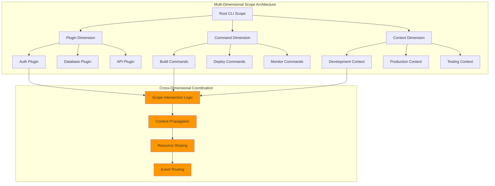

# CLI System Architecture

## Overview

The CLI system implements a sophisticated command-line interface framework built on the TUIX MVU architecture. It provides type-safe command definition, plugin extensibility, and scope-based command routing.

## Core Architecture

## Command Execution Flow

## Scope-Based Command Routing

## Help Generation Architecture

## Plugin Integration

## Error Handling Flow

## Performance Optimization

## Integration with Core Services

## Related Diagrams

- [JSX Runtime](./jsx-runtime.md) - JSX component integration with CLI
- [Plugin System](./plugin-system.md) - Plugin architecture details
- [Data Flows](../patterns/data-flows.md) - Core data flow patterns
- [Integration Patterns](../patterns/integration.md) - Module integration patterns