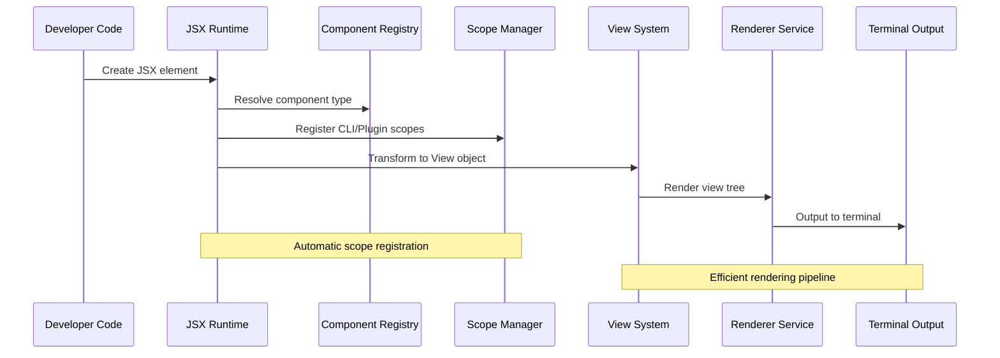
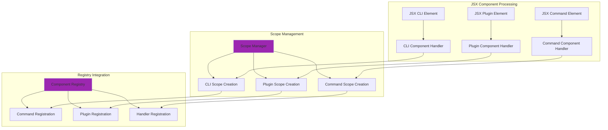
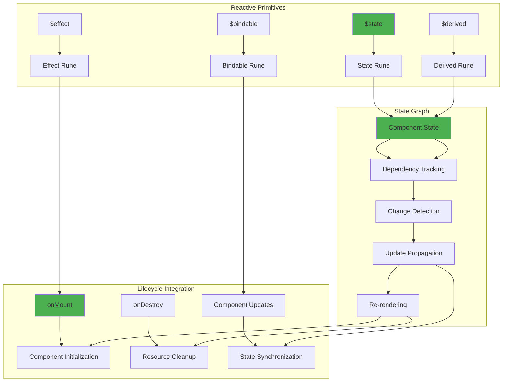
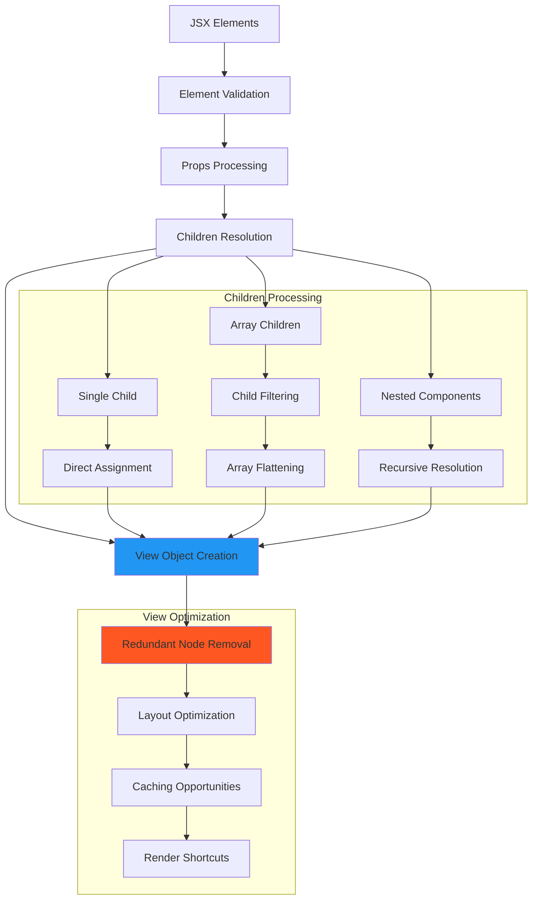
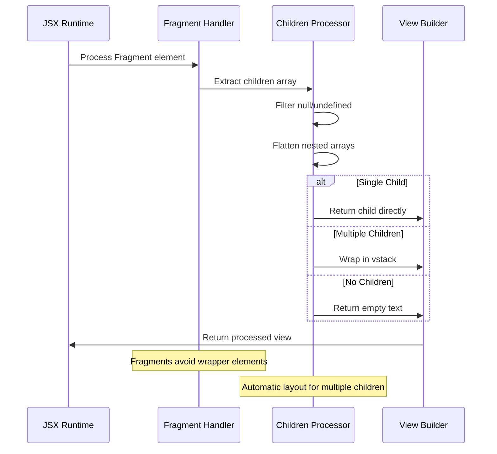
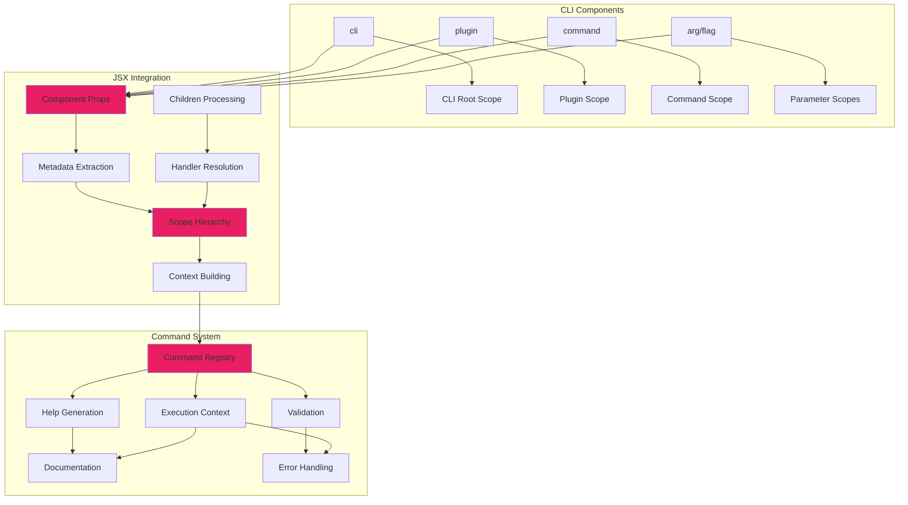
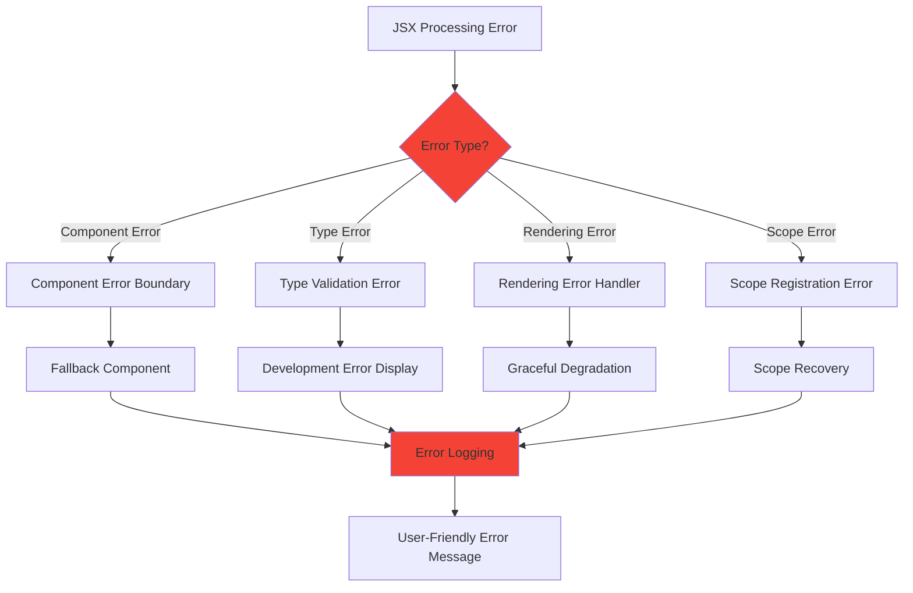
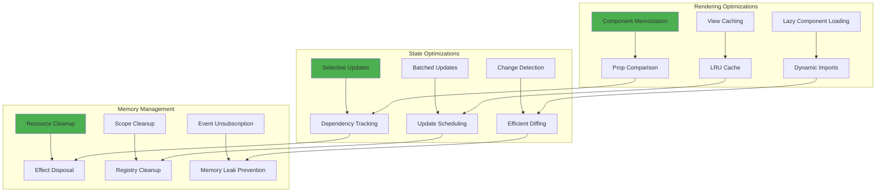
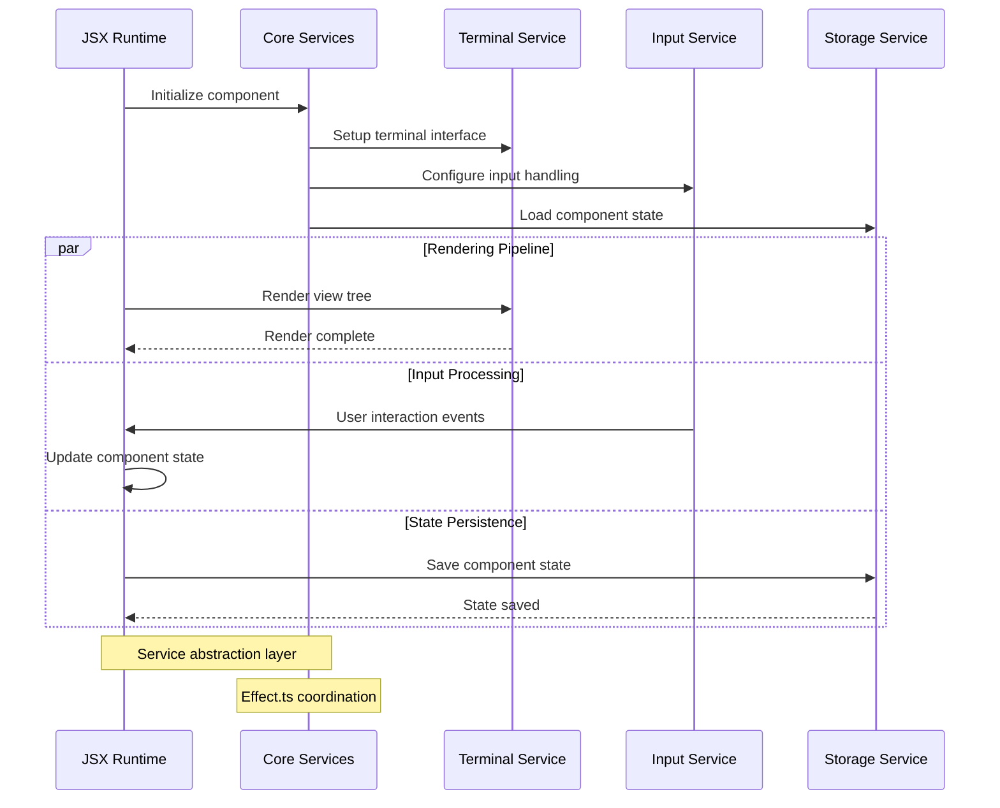

# JSX Runtime Architecture

## Overview

The JSX runtime enables React-like syntax for building terminal user interfaces with TUIX. It provides component-based development with Svelte-inspired reactive bindings and seamless integration with the CLI framework.

## Core JSX Processing Pipeline



## Component Type Resolution

```mermaid
flowchart TB
    A[JSX Element] --> B{Component Type?}
    B -->|Function Component| C[Execute Function]
    B -->|Intrinsic Element| D[Map to View Primitive]
    B -->|CLI Component| E[Register with Scope System]
    
    C --> F[Process Props & Children]
    D --> G[Apply Styling & Layout]
    E --> H[Update Command Registry]
    
    F --> I[Return View Object]
    G --> I
    H --> I
    
    subgraph "Intrinsic Elements"
        J[text → text()]
        K[box → box()]
        L[vstack → vstack()]
        M[hstack → hstack()]
        N[styled-text → styledText()]
    end
    
    D --> J
    D --> K
    D --> L
    D --> M
    D --> N
    
    style B fill:#2196f3
    style E fill:#ff9800
    style I fill:#4caf50
```

## Scope Registration Integration



## Reactive State Management



## View Tree Construction



## Fragment Support



## CLI Component Integration



## Error Handling in JSX



## Performance Optimizations



## Integration with Core Services



## Related Diagrams

- [CLI System](./cli-system.md) - CLI integration with JSX components
- [Plugin System](./plugin-system.md) - Plugin components in JSX
- [Data Flows](../patterns/data-flows.md) - Core data flow patterns
- [Advanced Patterns](../patterns/advanced.md) - Advanced JSX patterns