# Plugin System Architecture

## Overview

The TUIX plugin system provides a sophisticated, type-safe extensibility framework with hot-swapping capabilities, dependency resolution, and seamless integration with the CLI and JSX systems.

## Plugin Architecture Overview

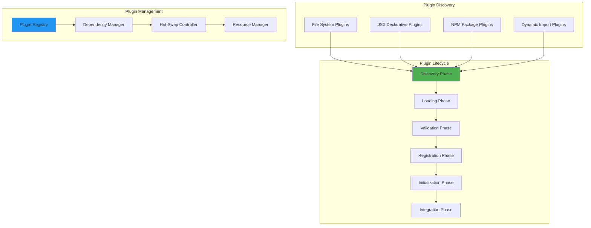

## Plugin Loading and Validation

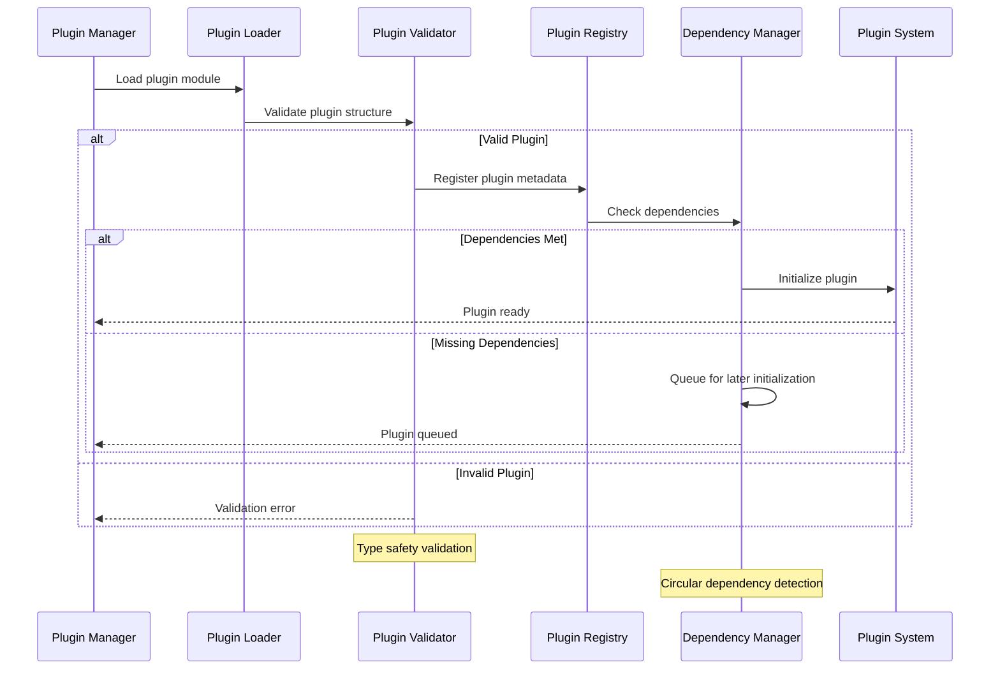

## Dependency Resolution Graph

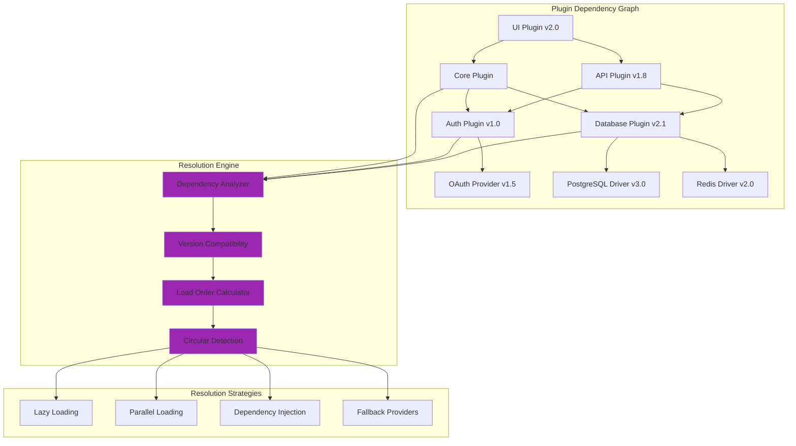

## Hot-Swapping Mechanism

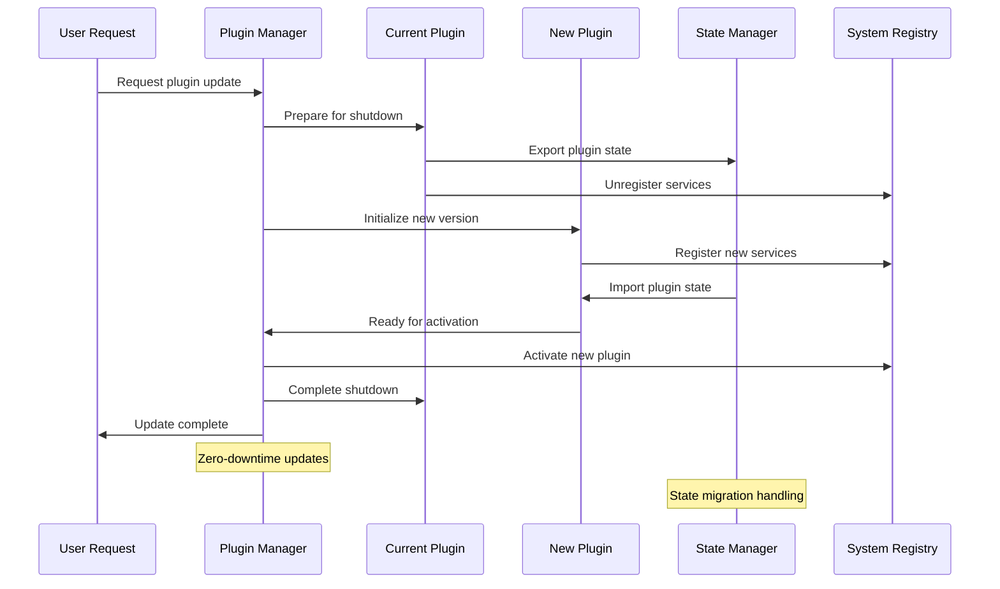

## Cross-Plugin Communication

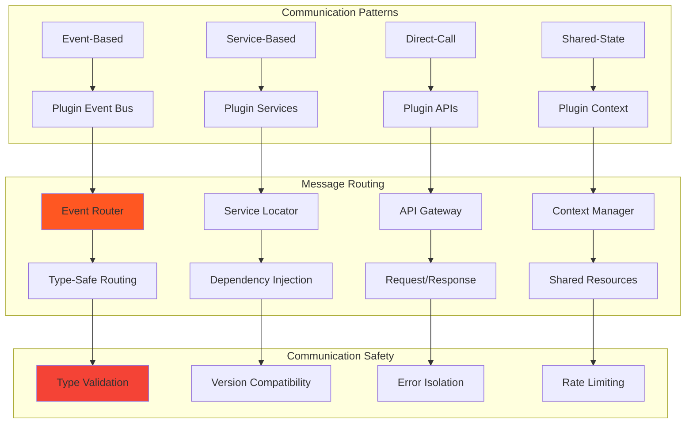

## Plugin Security Model

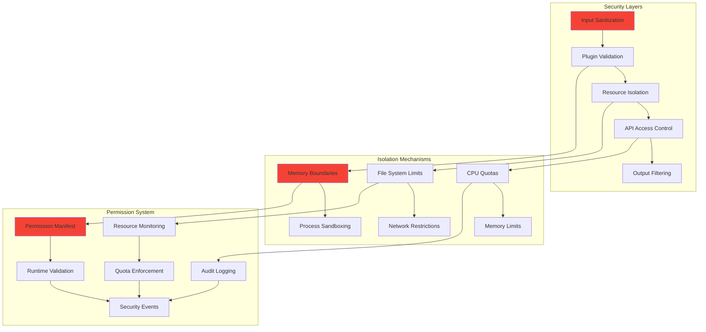

## JSX Plugin Integration

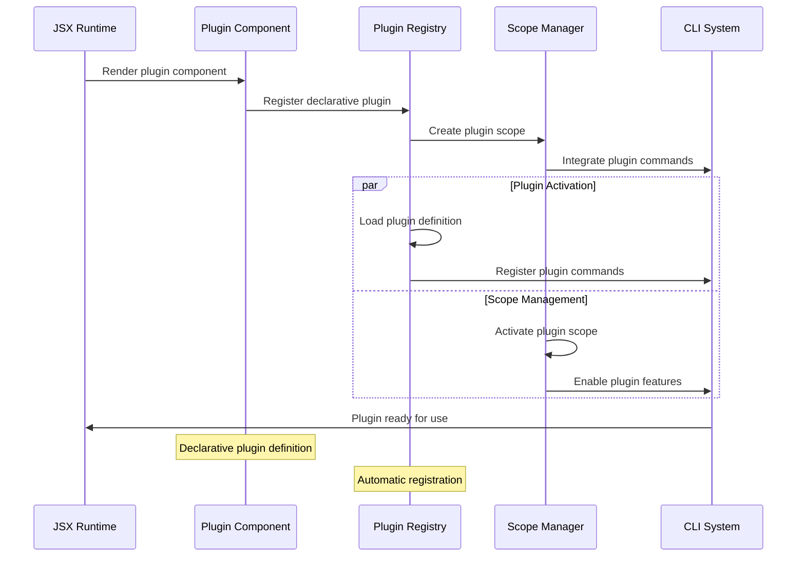

## Plugin Event System

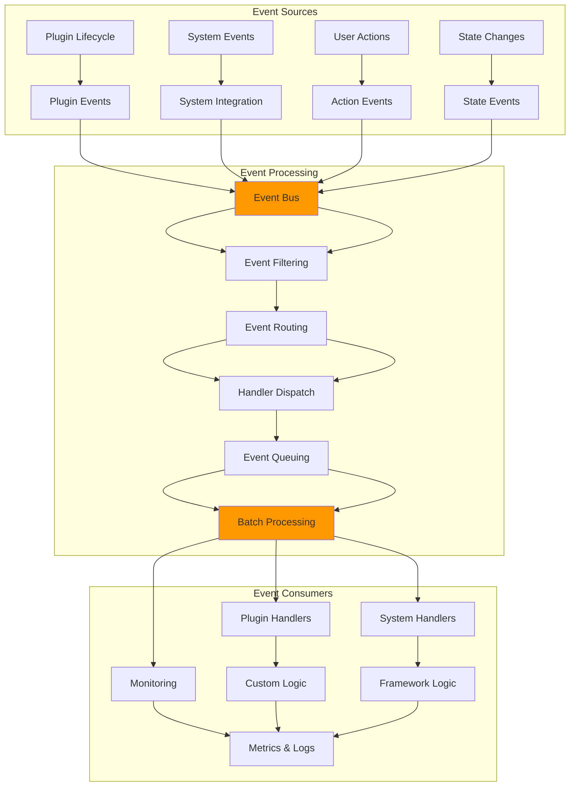

## Plugin Configuration Management

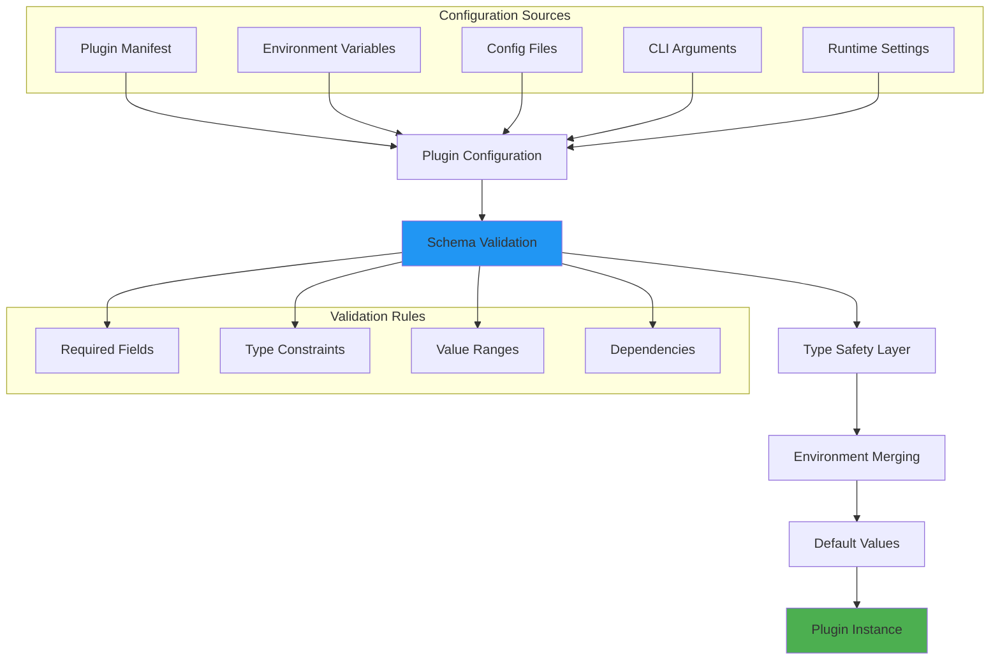

## Plugin Performance Monitoring

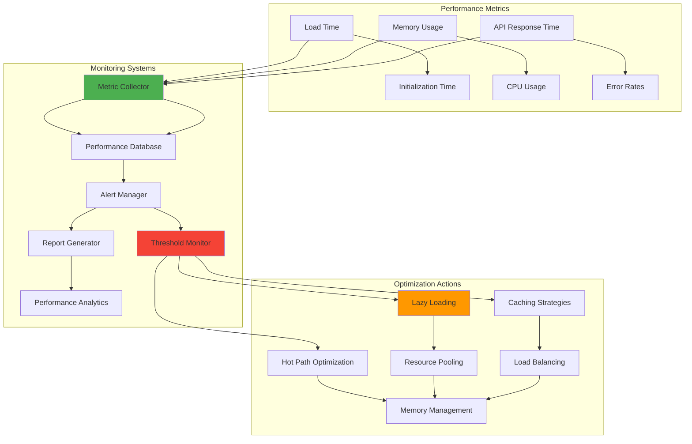

## Plugin Testing Framework

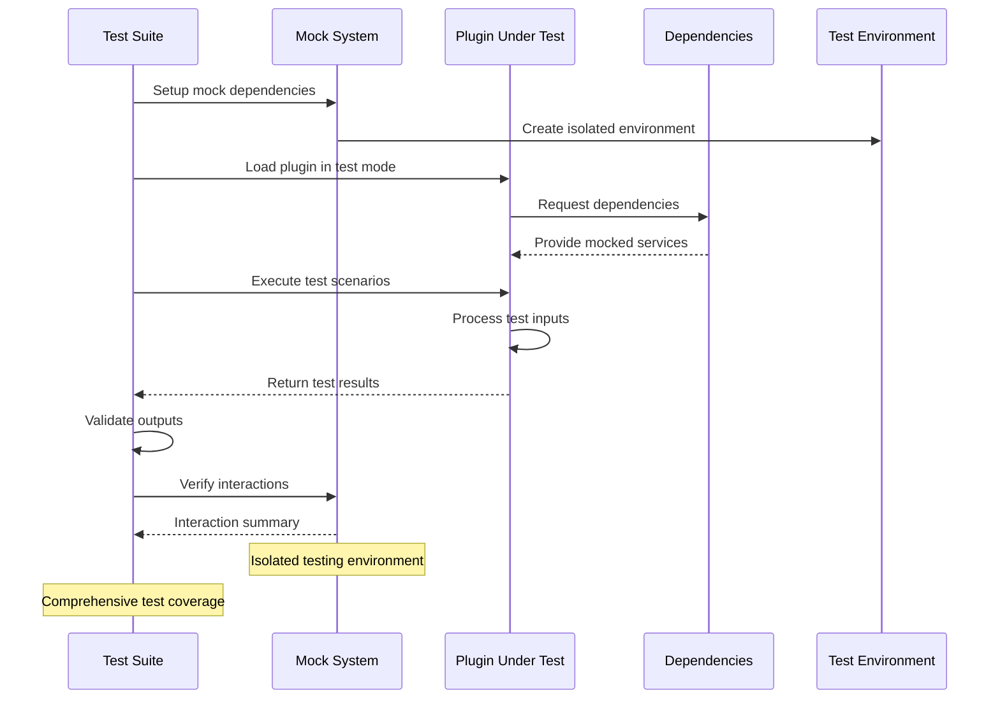

## Related Diagrams

- [CLI System](./cli-system.md) - CLI integration with plugins
- [JSX Runtime](./jsx-runtime.md) - JSX plugin components
- [Data Flows](../patterns/data-flows.md) - Plugin data flow patterns
- [Integration Patterns](../patterns/integration.md) - Plugin integration strategies