# Process Management Architecture

## Overview

The Process Management system provides comprehensive lifecycle management for spawned processes, with health monitoring, resource tracking, and sophisticated event choreography for enterprise-scale applications.

## Core Process Management Architecture

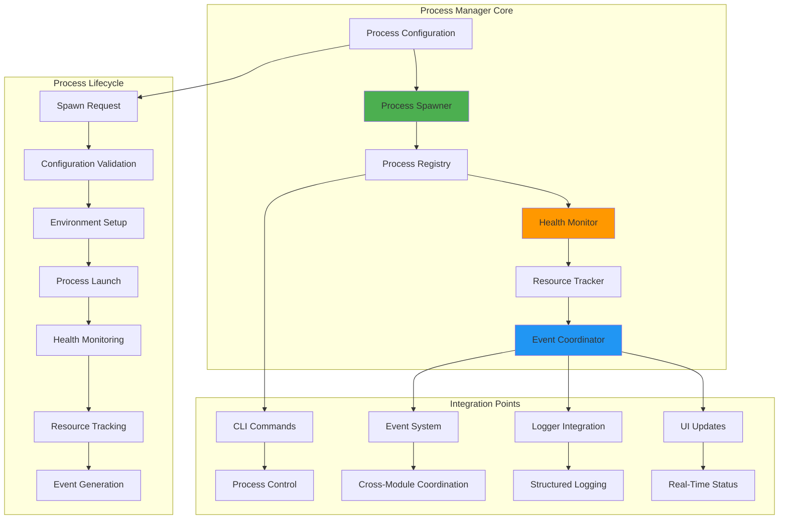

## Process Lifecycle Management

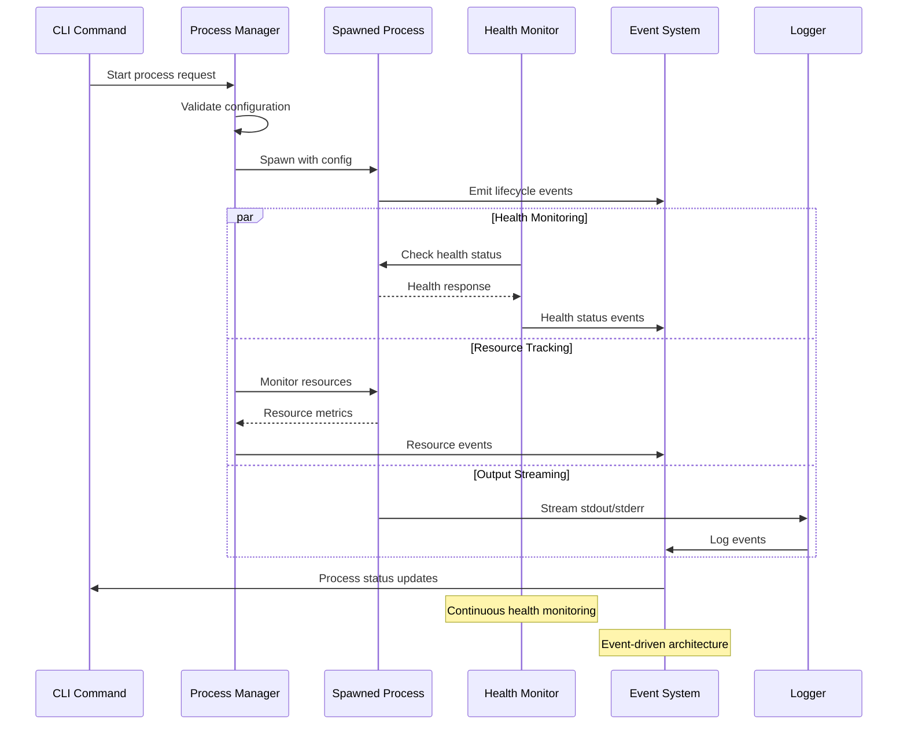

## Health Monitoring System

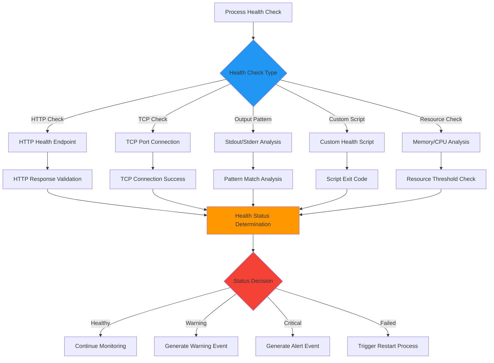

## Resource Monitoring and Tracking

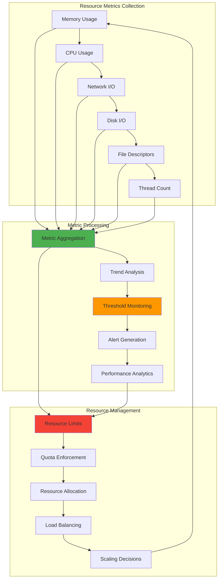

## Event Choreography Integration

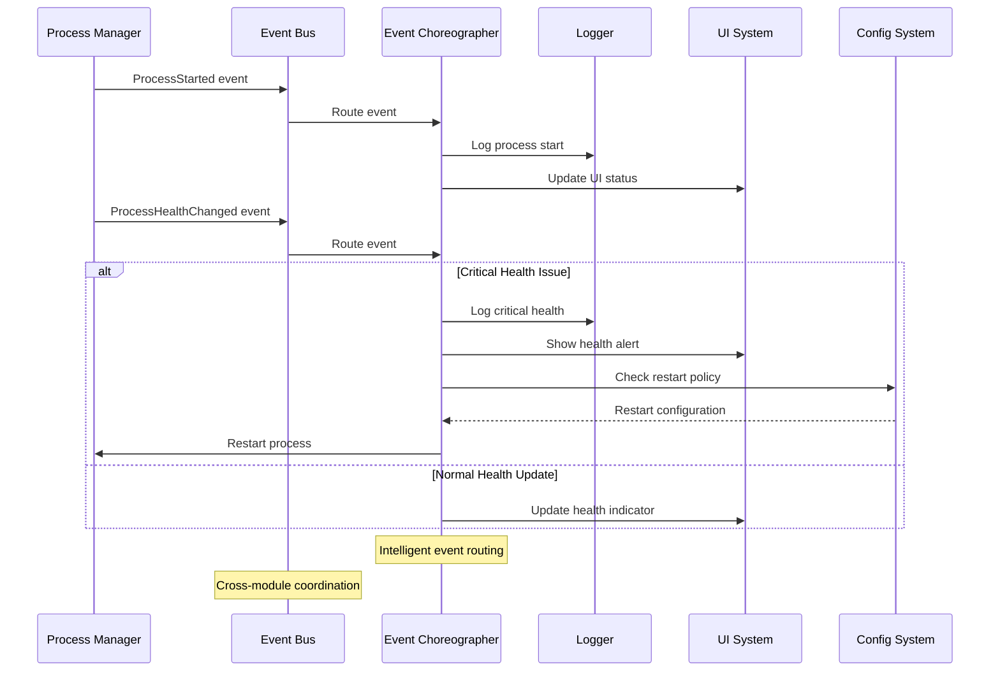

## File Watching and Auto-Restart

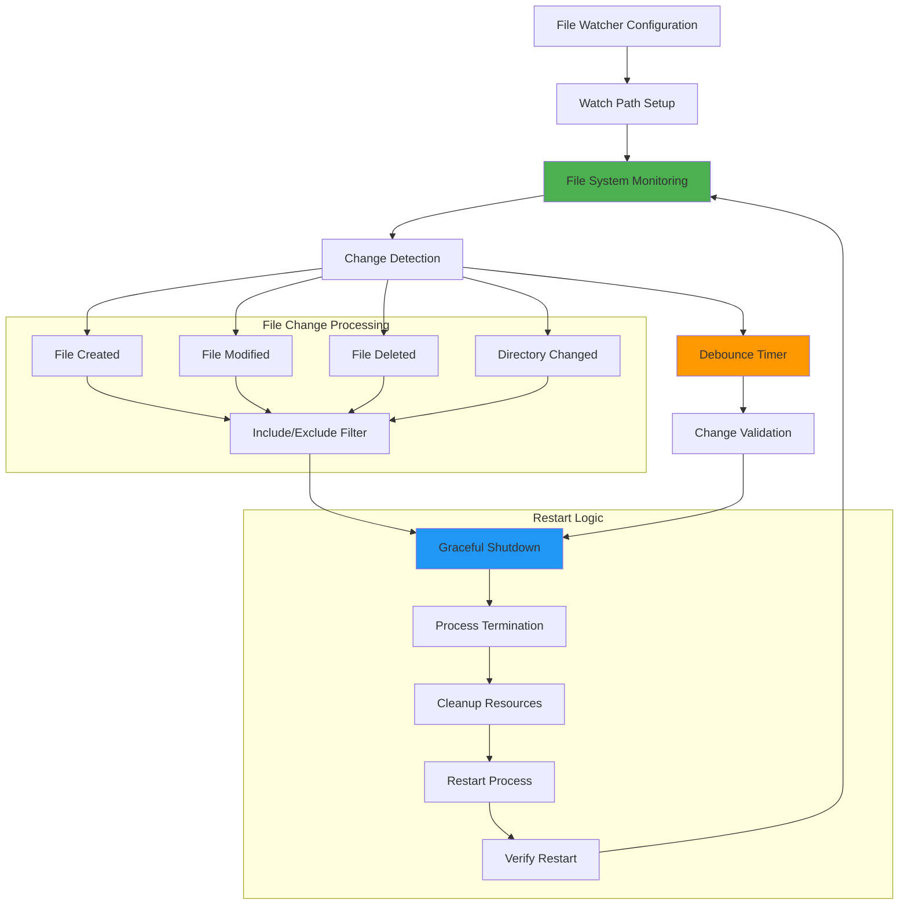

## Process Communication and IPC

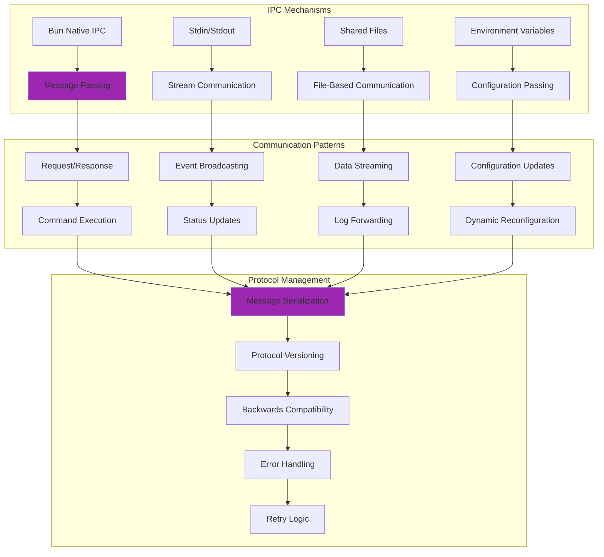

## Clustering and Load Distribution

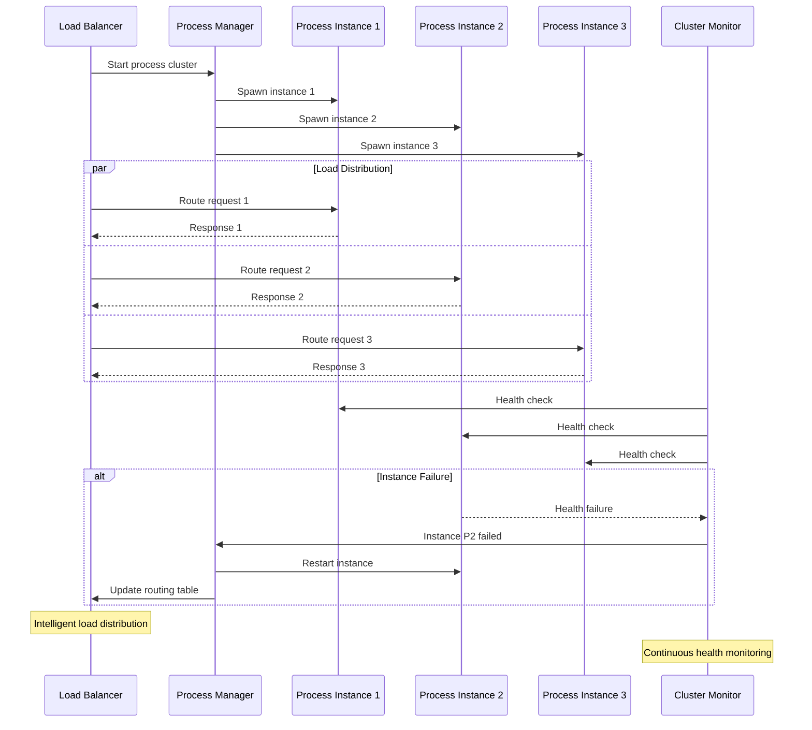

## Process Configuration Management

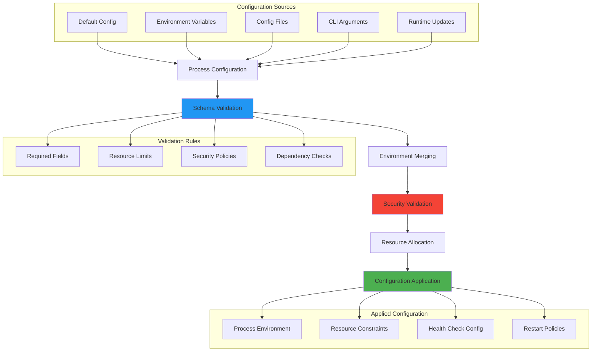

## Error Handling and Recovery

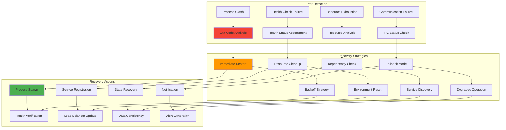

## Performance Optimization

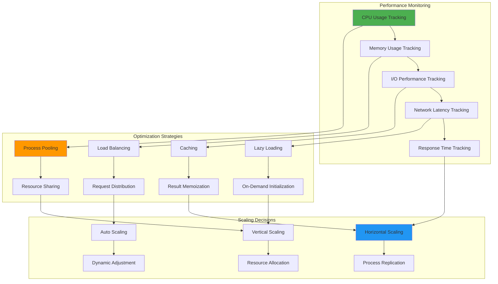

## Related Diagrams

- [CLI System](./cli-system.md) - CLI integration with process management
- [Data Flows](../patterns/data-flows.md) - Process management data flows
- [Integration Patterns](../patterns/integration.md) - Process integration strategies
- [Advanced Patterns](../patterns/advanced.md) - Advanced process orchestration