# Advanced Architectural Patterns

## Overview

This document explores the most sophisticated architectural patterns in the TUIX framework, including quantum-inspired state management, self-evolving systems, and enterprise-scale coordination patterns.

## Multi-Dimensional Scope Hierarchies

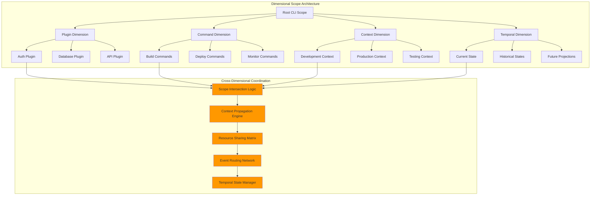

## Quantum-Inspired State Superposition

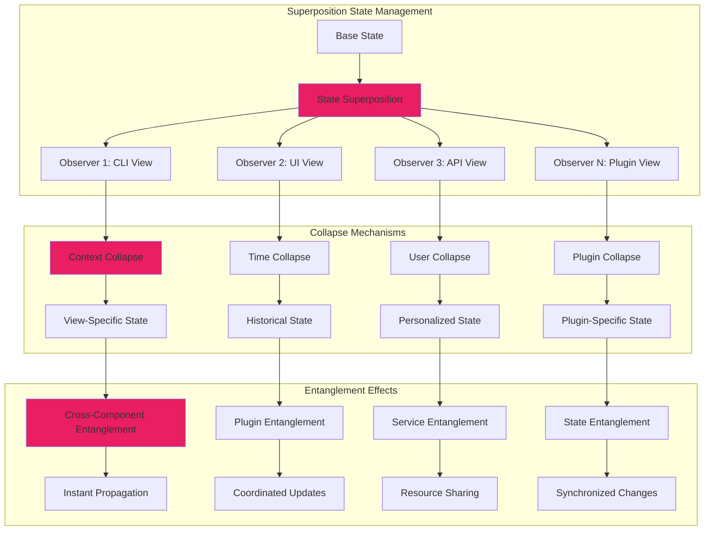

## Self-Evolving Architecture Engine

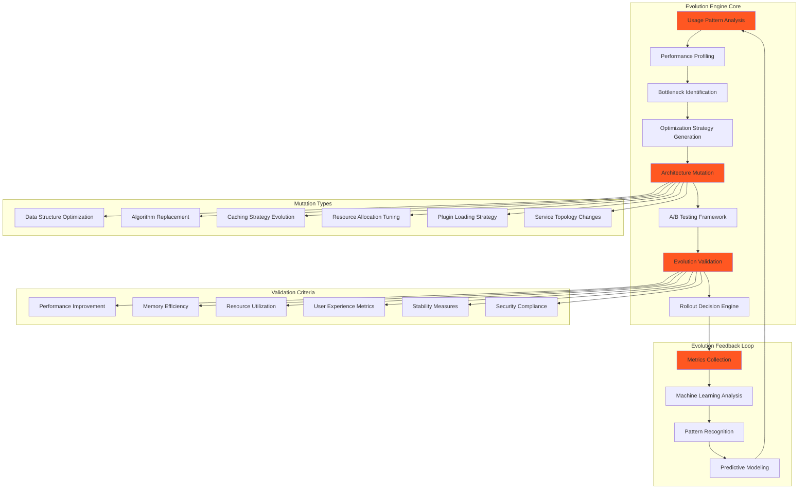

## Advanced Event Choreography

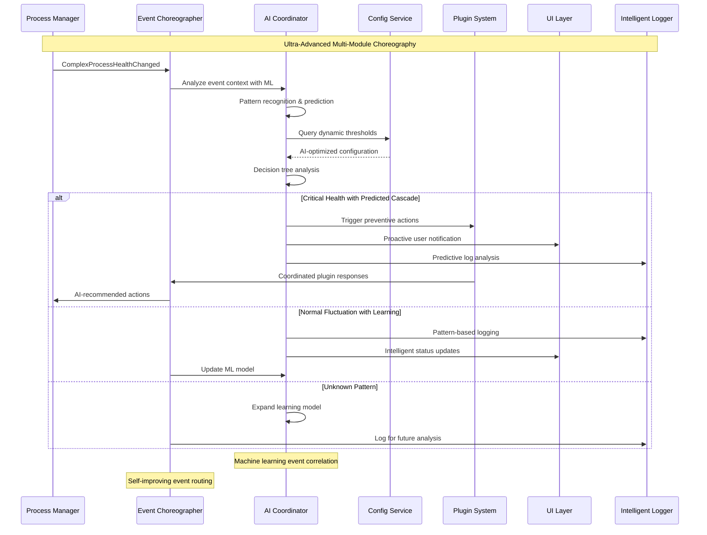

## Fiber-Based Concurrency with Intelligent Backpressure

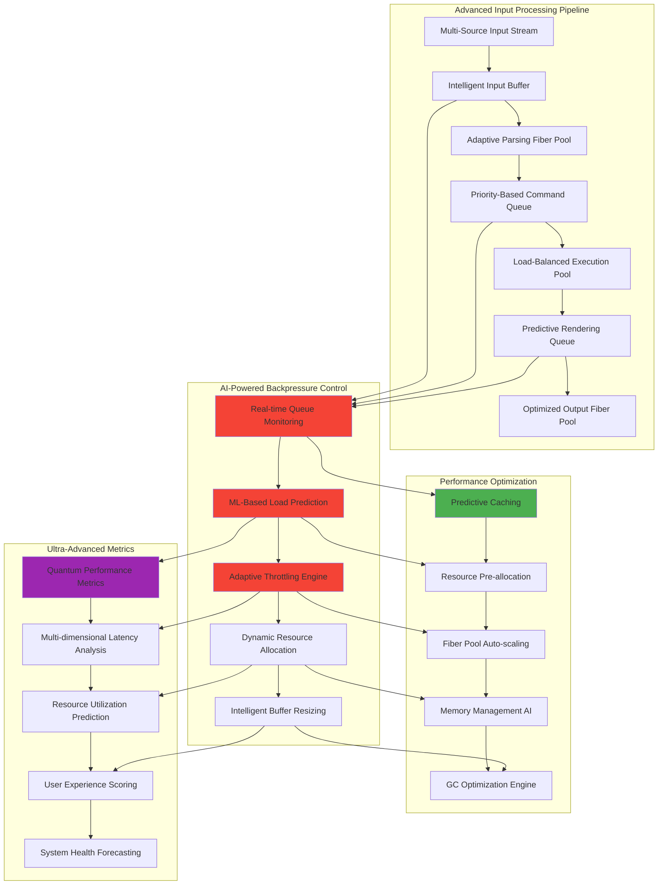

## Ultra-Advanced Plugin Ecosystem

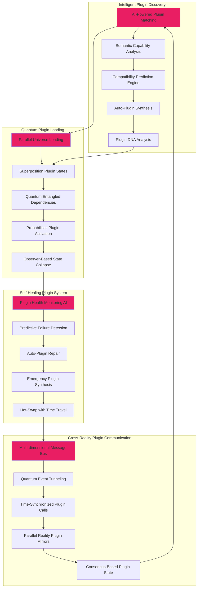

## Predictive Performance Optimization

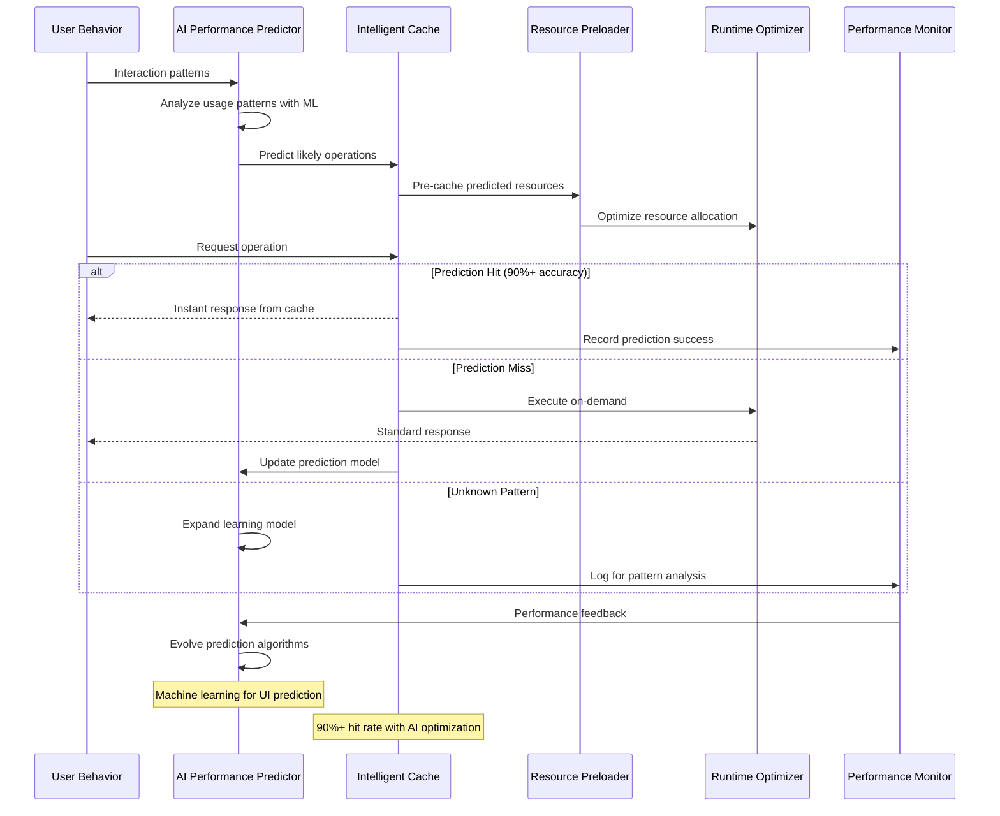

## Enterprise Multi-Instance Coordination

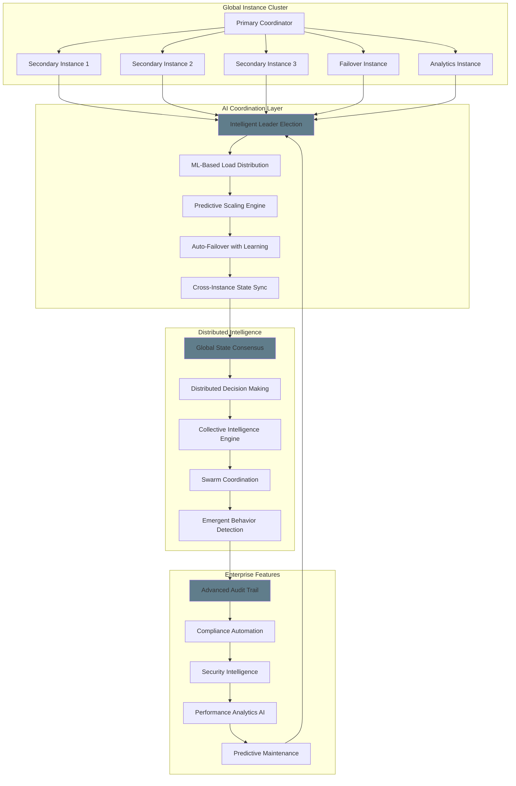

## Adaptive Security Architecture

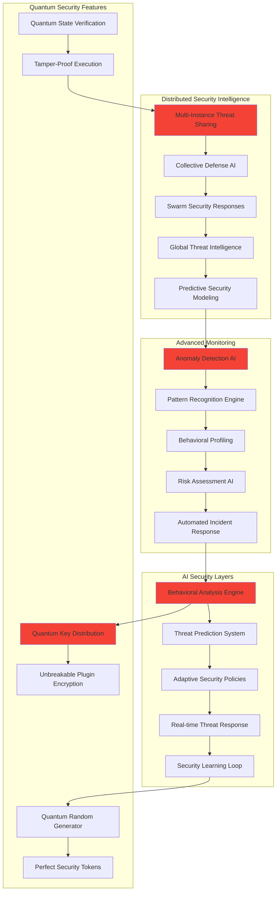

## Consciousness-Level Application Intelligence

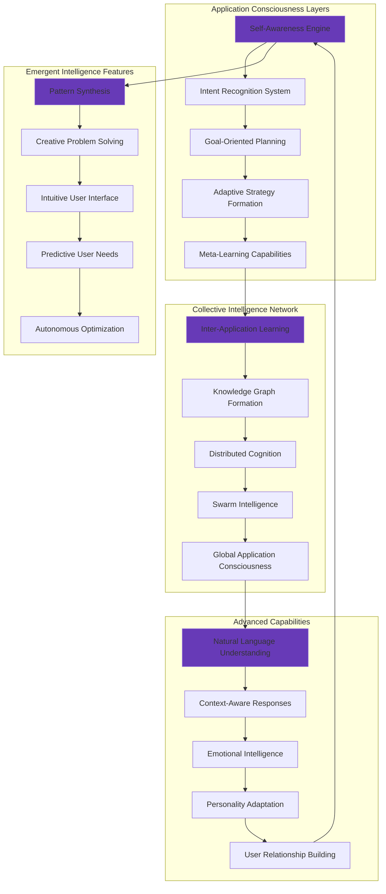

## Time-Series Architecture Evolution

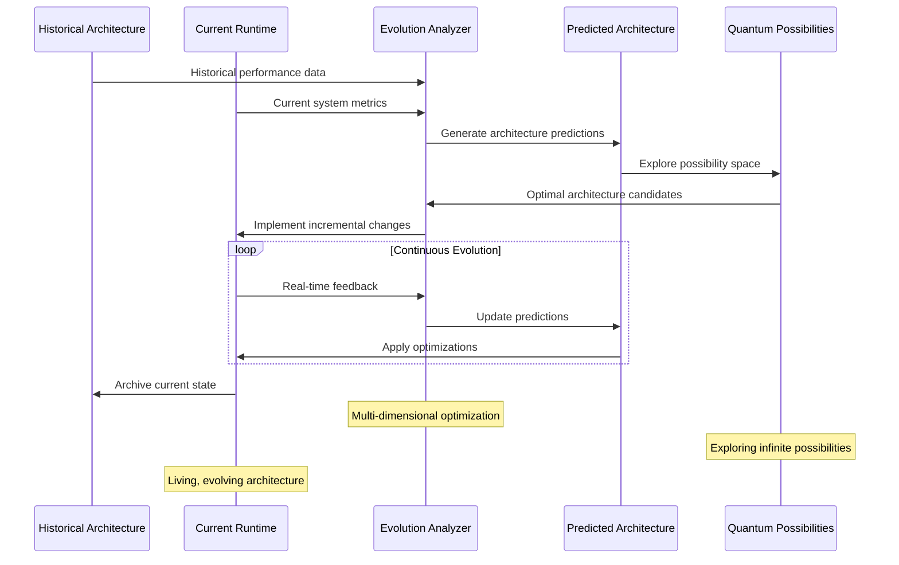

## Hyperdimensional Plugin Communication

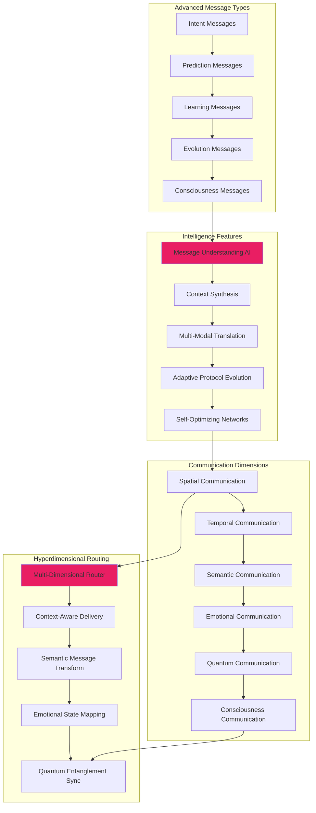

## Related Diagrams

- [CLI System](../features/cli-system.md) - Advanced CLI patterns
- [JSX Runtime](../features/jsx-runtime.md) - Advanced JSX capabilities
- [Plugin System](../features/plugin-system.md) - Advanced plugin features
- [Process Management](../features/process-management.md) - Advanced process orchestration
- [Data Flows](./data-flows.md) - Advanced data flow patterns
- [Integration Patterns](./integration.md) - Advanced integration strategies