# Core Data Flow Patterns

## Overview

This document maps the fundamental data flow patterns in the TUIX framework, demonstrating how information moves through the MVU architecture, service layers, and module boundaries.

## MVU Loop Implementation

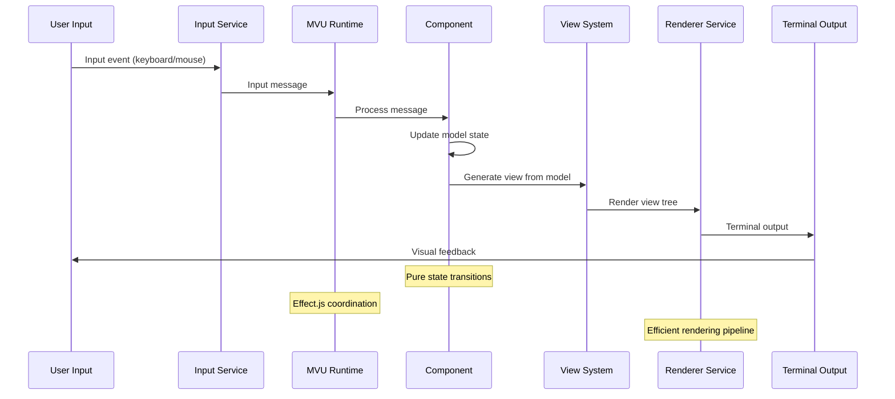

## Event Propagation Patterns

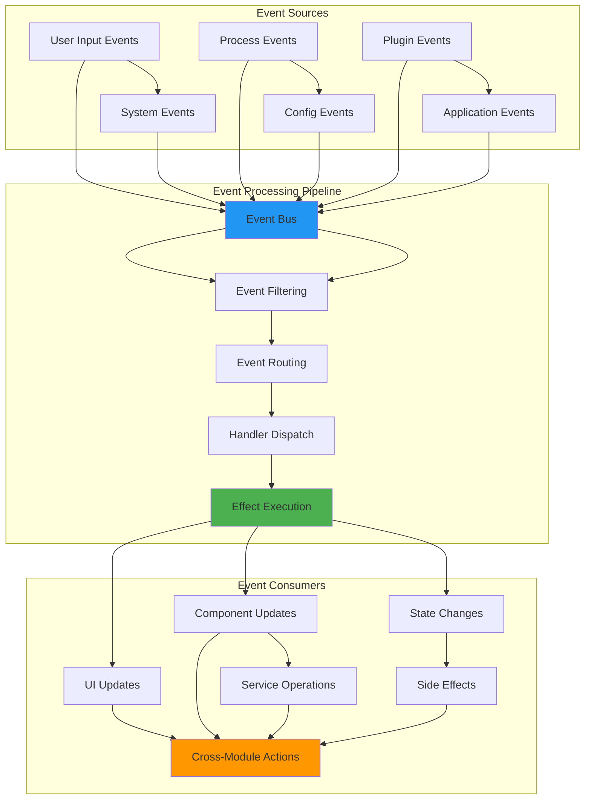

## State Synchronization Flows

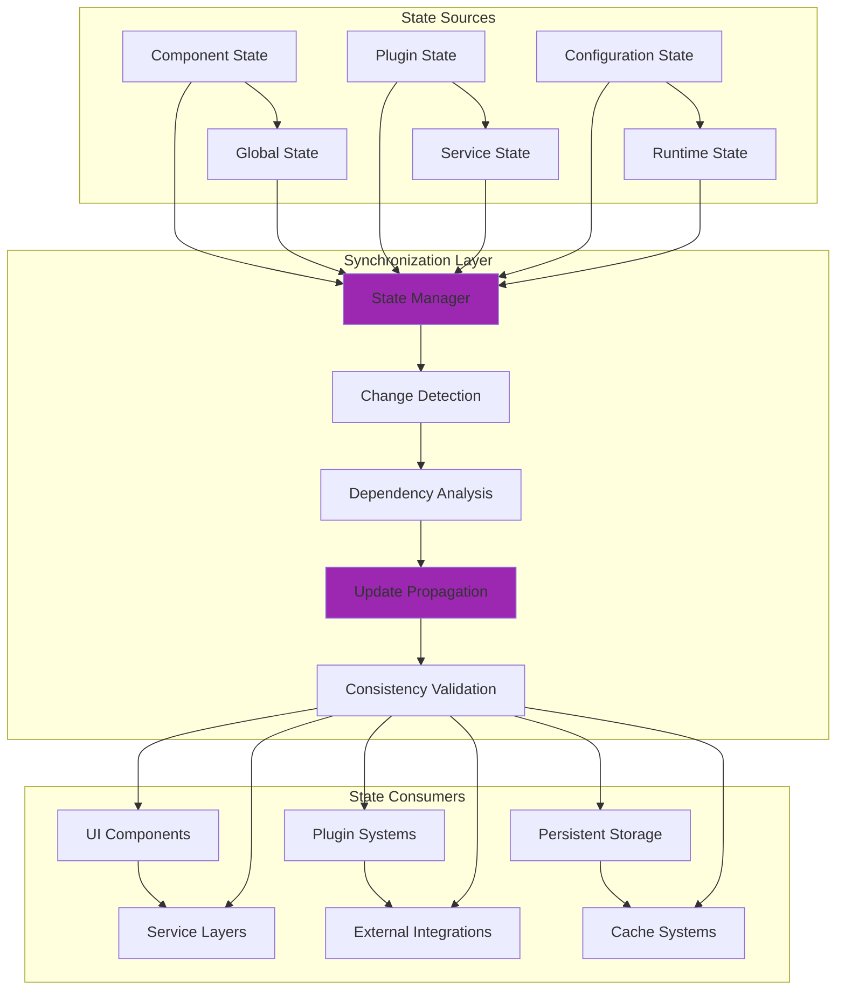

## Service Layer Data Flow

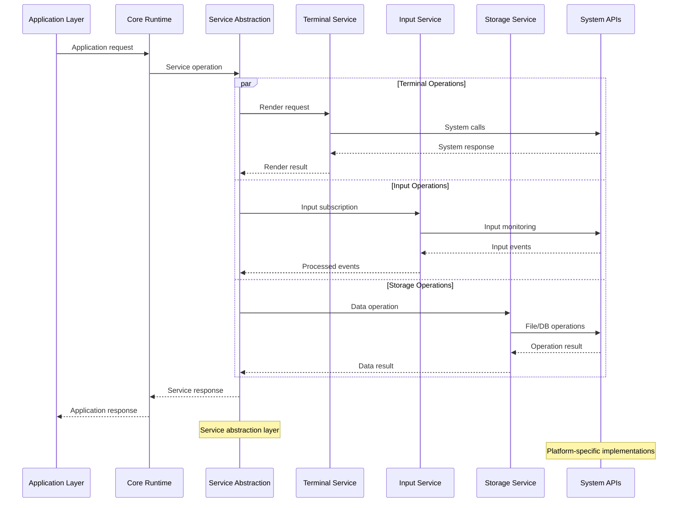

## Plugin Data Integration

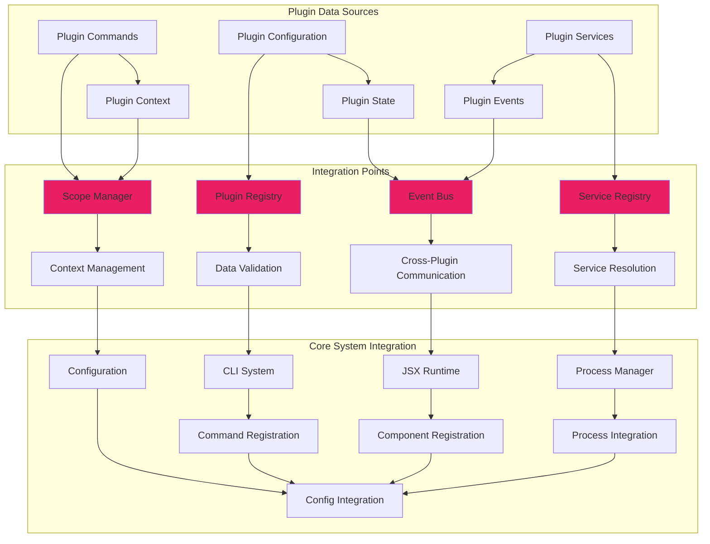

## Reactive State Graph

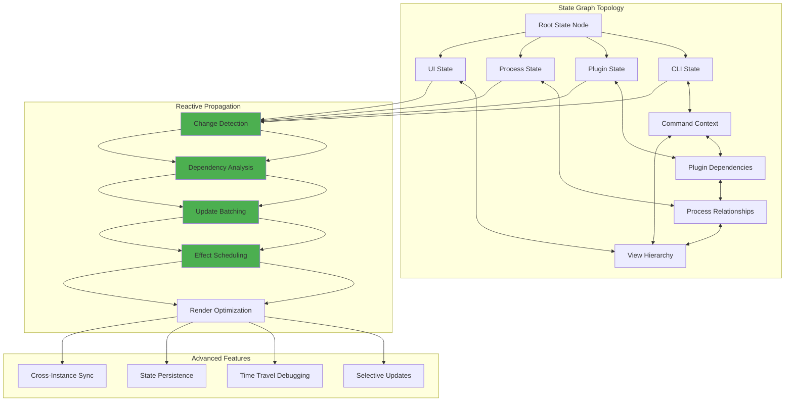

## Command Execution Data Flow

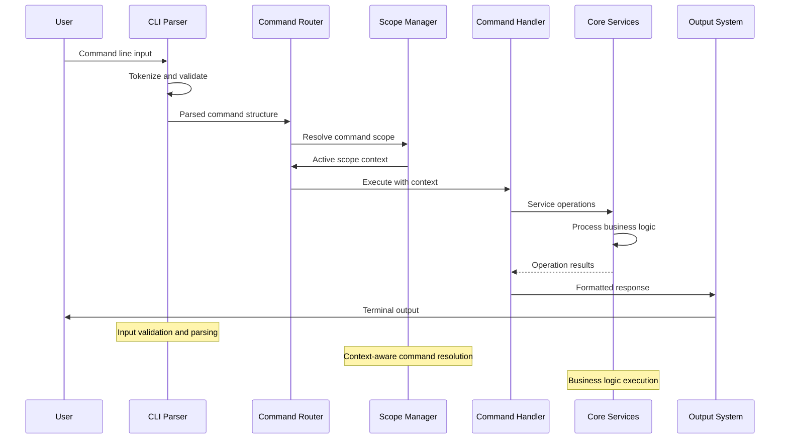

## Error Flow Patterns

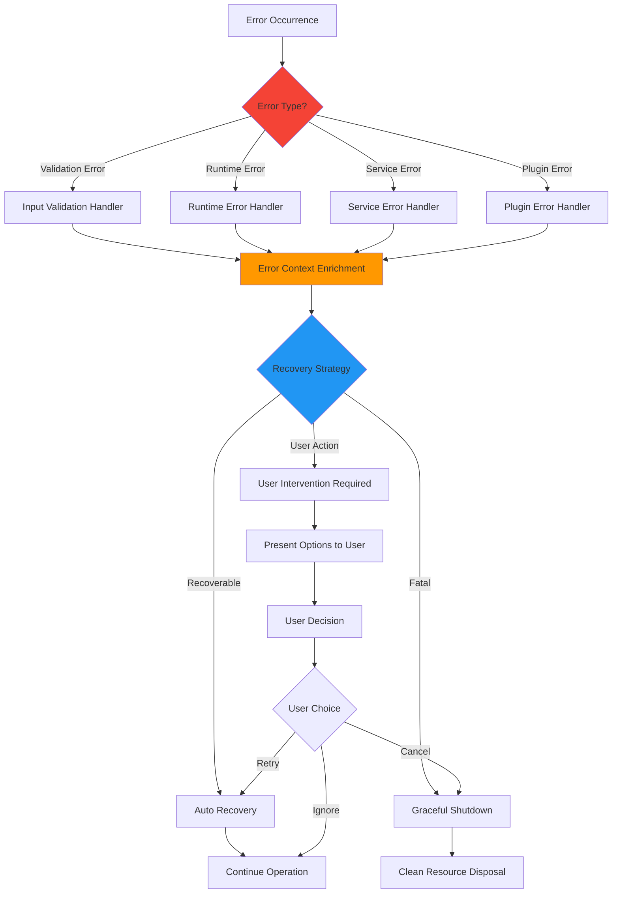

## Cross-Module Data Exchange

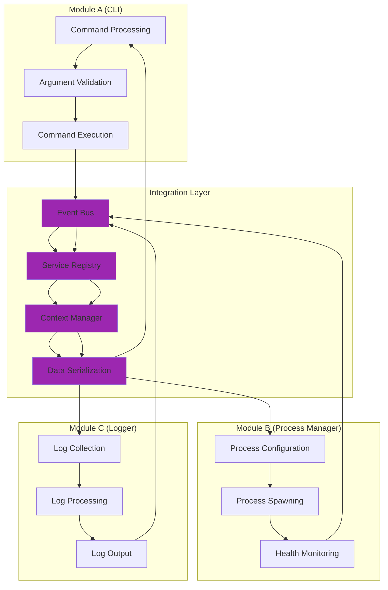

## Real-Time Data Streams

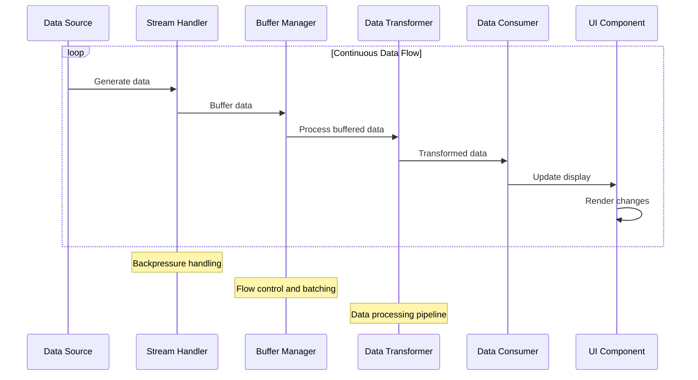

## Performance Data Flows

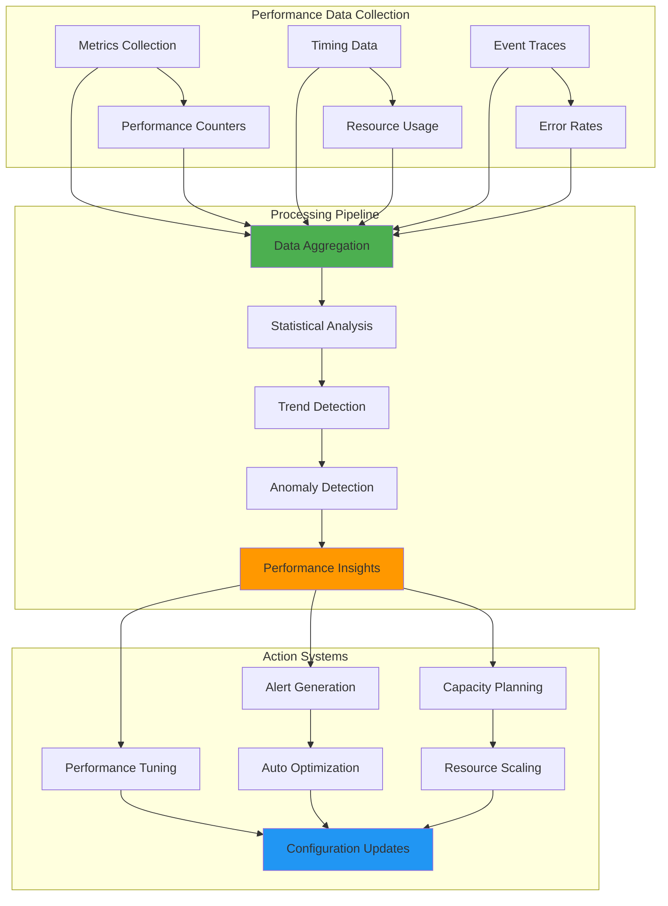

## Related Diagrams

- [CLI System](../features/cli-system.md) - CLI-specific data flows
- [JSX Runtime](../features/jsx-runtime.md) - JSX component data flows  
- [Plugin System](../features/plugin-system.md) - Plugin data integration
- [Process Management](../features/process-management.md) - Process management flows
- [Integration Patterns](./integration.md) - Module integration patterns
- [Advanced Patterns](./advanced.md) - Advanced data flow patterns