# Module Integration Patterns

## Overview

This document illustrates the sophisticated integration patterns used throughout the TUIX framework, showing how modules interact, share resources, and coordinate complex workflows.

## Service Layer Integration Architecture

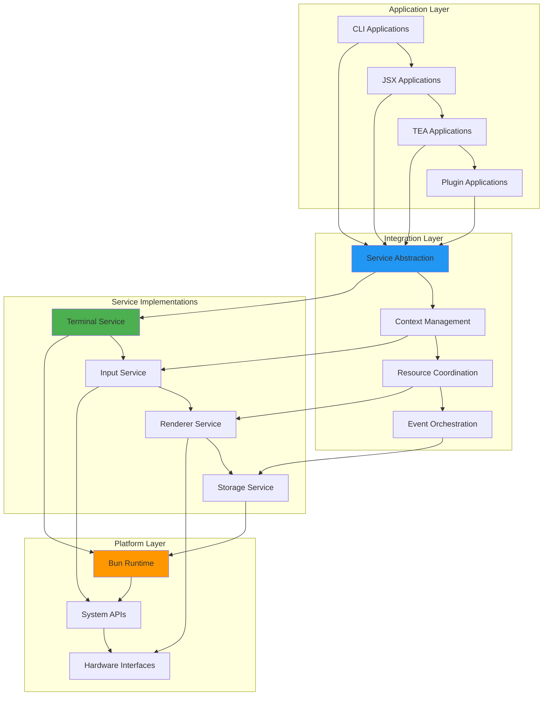

## CLI ↔ JSX Integration Pattern

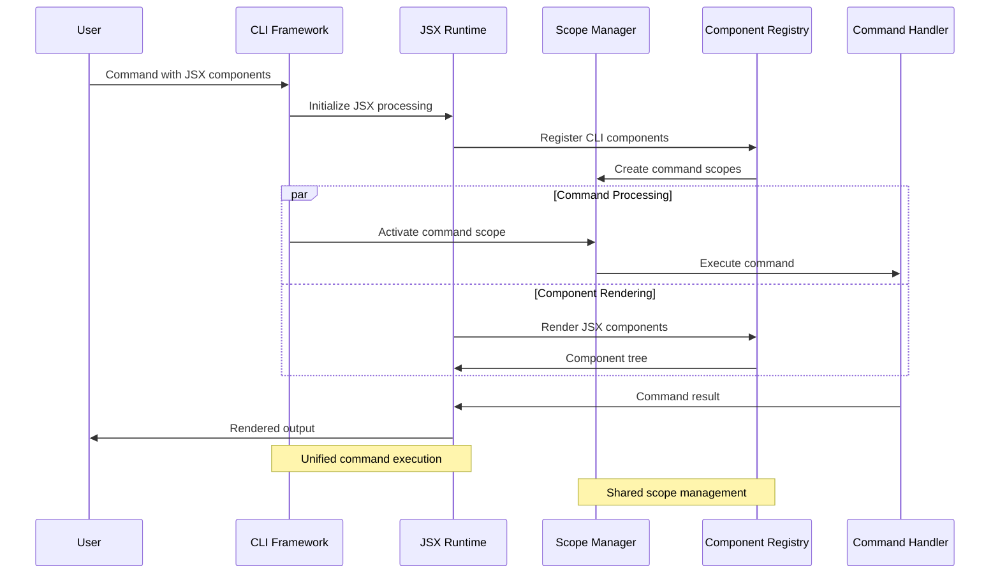

## Plugin Integration Ecosystem

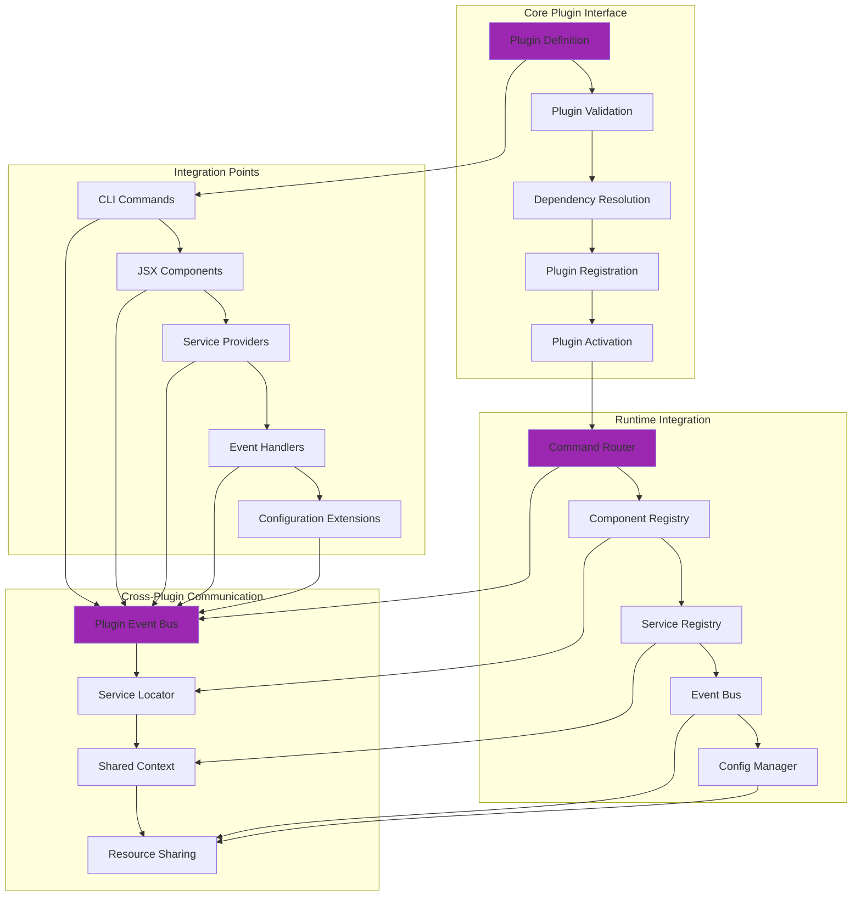

## Event System Integration

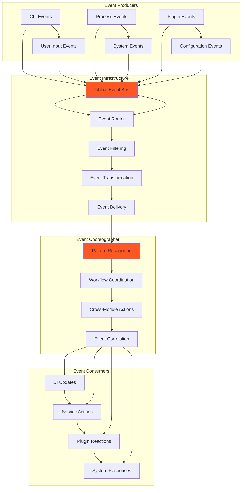

## Cross-Module State Synchronization

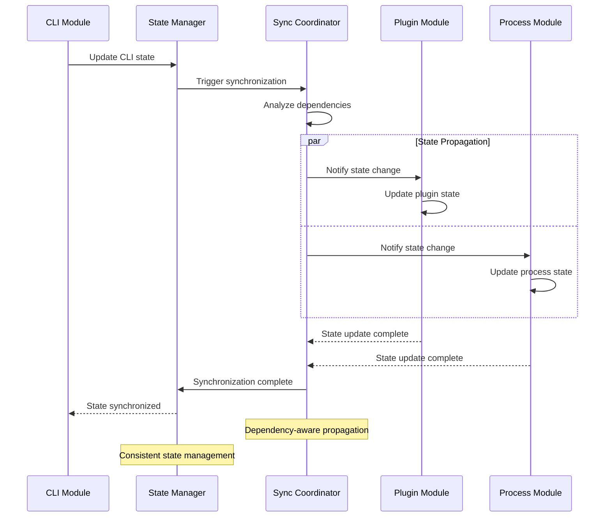

## Service-to-Service Communication

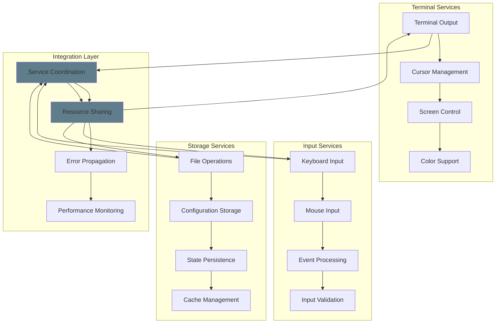

## Configuration System Integration

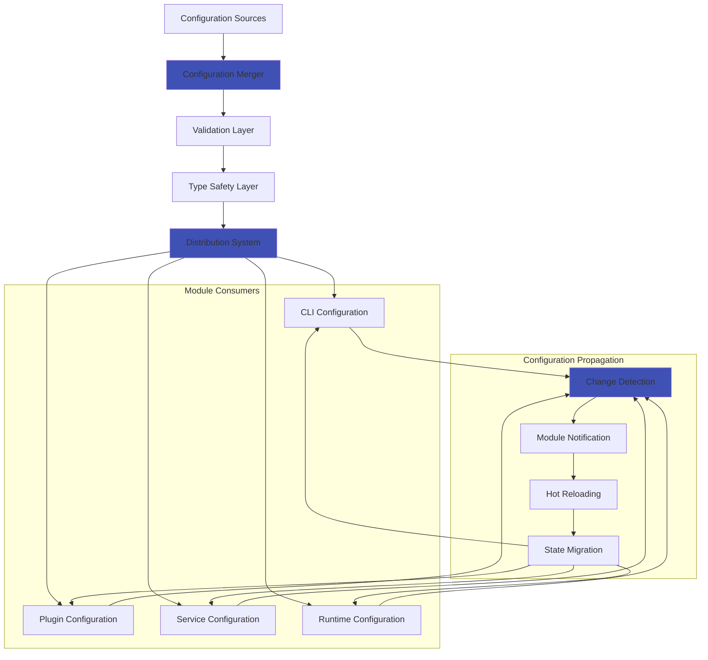

## Error Boundary Integration

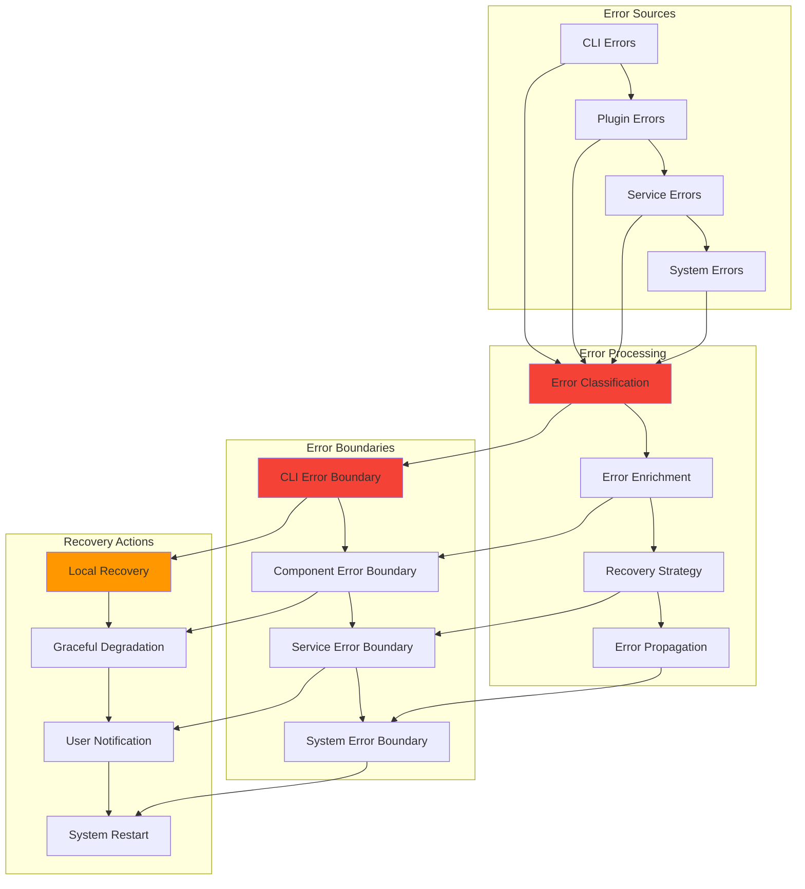

## Resource Management Integration

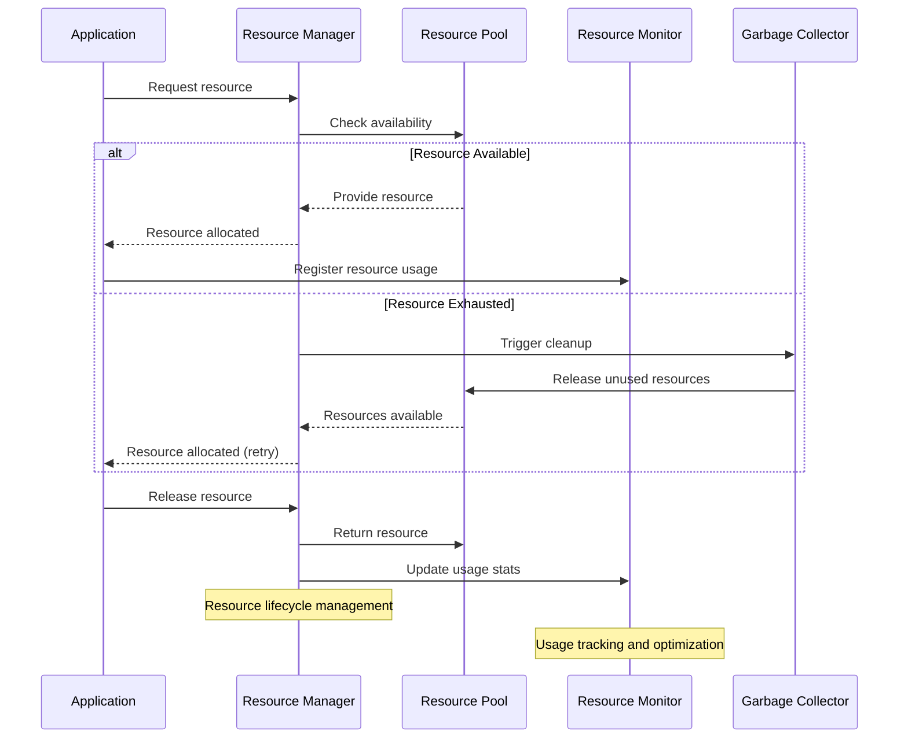

## Testing Integration Patterns

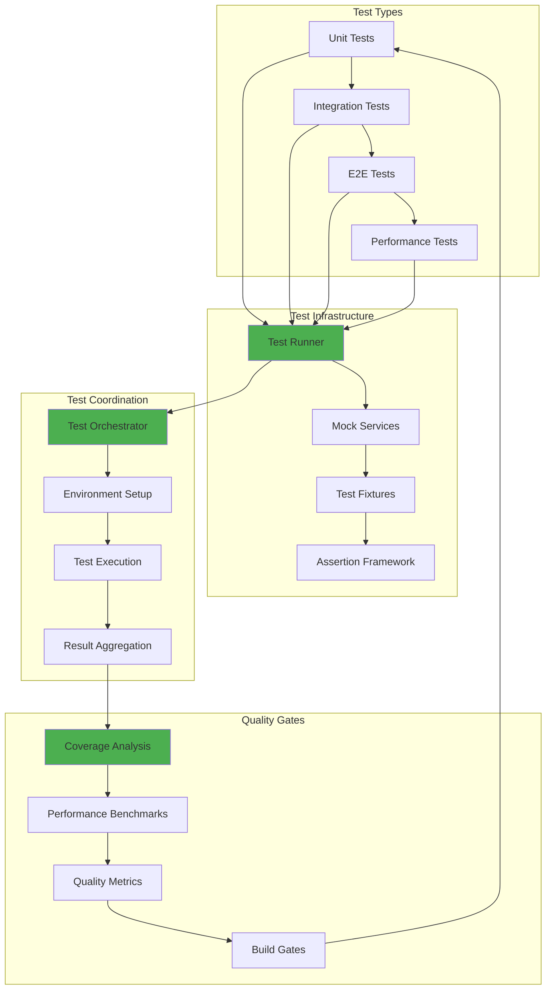

## DevOps Integration Pipeline

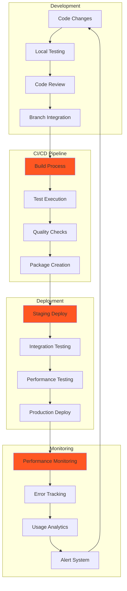

## Multi-Instance Coordination

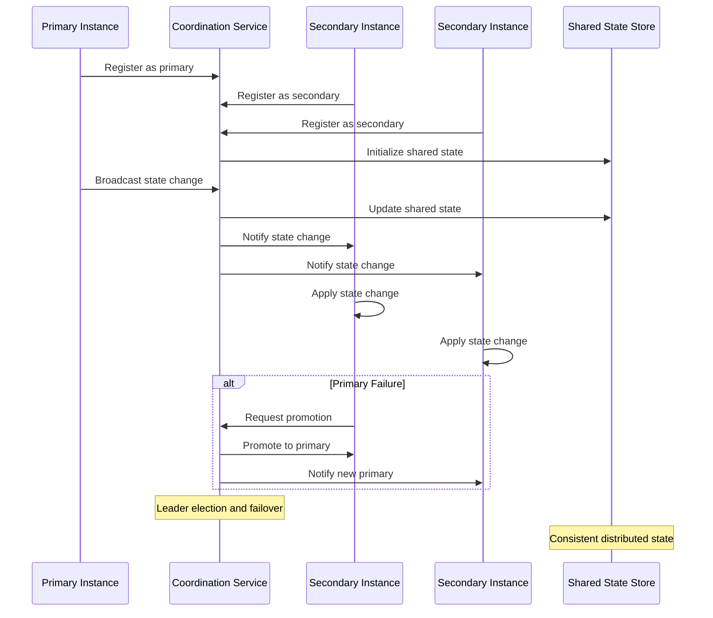

## Related Diagrams

- [CLI System](../features/cli-system.md) - CLI integration specifics
- [JSX Runtime](../features/jsx-runtime.md) - JSX integration patterns
- [Plugin System](../features/plugin-system.md) - Plugin integration details
- [Process Management](../features/process-management.md) - Process integration
- [Data Flows](./data-flows.md) - Core data flow patterns
- [Advanced Patterns](./advanced.md) - Advanced integration patterns